# roadmap-to-Staff-Principal-in-AI
Personal theory roadmap from ML fundamentals to Aug 2026 state of the art — 12 modules, ~140 sub-topics

# Index — From Zero to Staff/Principal in AI

---

## Module 0.0 — Mathematical Foundations and Classical ML

### 0.0.1 — Applied linear algebra — vectors, matrices, dot product

**Simple explanation:** Imagine you are a real estate agent trying to price houses. A single house can be described by a list of features: number of rooms, square footage, and distance to the city center. This list is a vector. To calculate a final price, you multiply each feature by a corresponding weight (importance) and sum them up. This fundamental operation of multiplying matching elements and adding them together is the dot product.

**How it works:** In machine learning, vectors represent points in a high-dimensional feature space, while matrices represent linear transformations that rotate, scale, or project these spaces. The dot product of two vectors $\mathbf{u}$ and $\mathbf{v}$ is defined as $\mathbf{u} \cdot \mathbf{v} = \sum_{i=1}^n u_i v_i = \|\mathbf{u}\| \|\mathbf{v}\| \cos(\theta)$, which measures both the magnitude and spatial alignment (similarity) of the vectors. Matrix multiplication $C = AB$ represents the composition of linear maps, where each entry $c_{ij}$ is the dot product of the $i$-th row of $A$ and the $j$-th column of $B$. In deep learning, these operations are highly optimized via Basic Linear Algebra Subprograms (BLAS) libraries running on GPUs, where weight matrices transform activation vectors across layers.

**Diagram:**
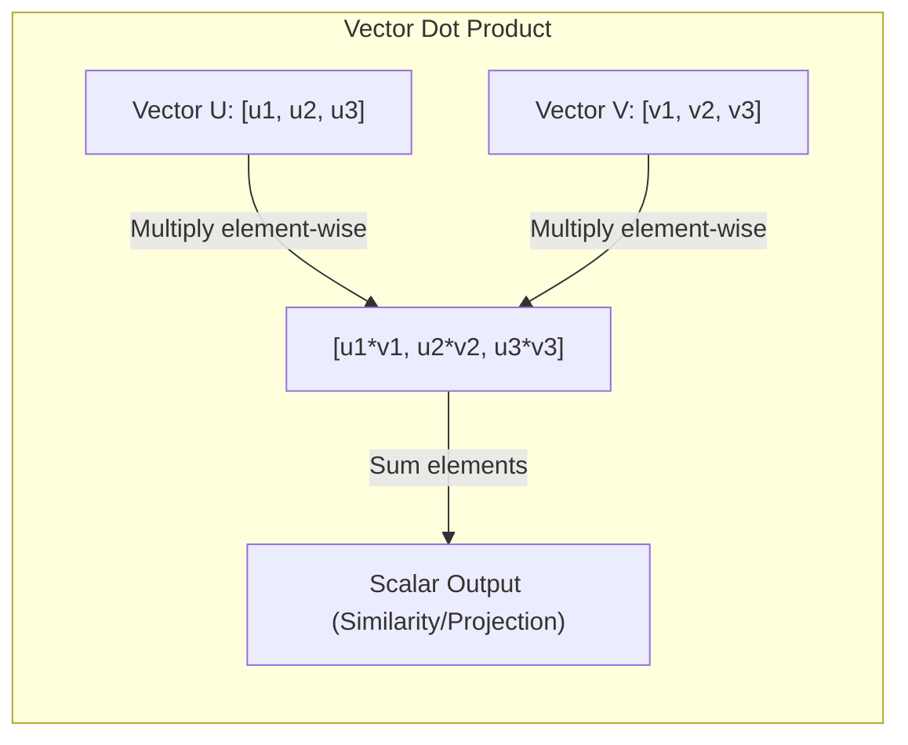

**Practical example:**
Suppose we have a feature vector for a token embedding $\mathbf{x} = [0.5, -1.2, 0.8]$ and a query projection vector $\mathbf{w} = [1.5, 0.0, -2.0]$.
The dot product is calculated as:
$$\mathbf{x} \cdot \mathbf{w} = (0.5 \times 1.5) + (-1.2 \times 0.0) + (0.8 \times -2.0)$$
$$\mathbf{x} \cdot \mathbf{w} = 0.75 + 0.0 - 1.6 = -0.85$$
This scalar indicates a negative correlation/alignment between the token feature and the query direction.

**Why it matters:** Every neural network operation, from simple dense layers to complex multi-head attention mechanisms, boils down to massive matrix multiplications. Understanding these operations is critical for calculating memory footprints, model parameter counts, and designing custom tensor architectures.

---

### 0.0.2 — Functions, derivatives and gradient — the idea of "slope" that makes learning possible

**Simple explanation:** Imagine walking down a mountain in thick fog. You cannot see the bottom, but you can feel the slope of the ground under your feet. By taking steps in the direction where the ground goes down the steepest, you will eventually reach the valley. The derivative tells you the slope of the hill at your exact spot, and the gradient is the compass pointing in the direction of the steepest ascent.

**How it works:** A derivative $\frac{df}{dx}$ measures the instantaneous rate of change of a function $f(x)$ with respect to changes in its input $x$. For multivariate functions $f(\mathbf{x})$, the gradient $\nabla f(\mathbf{x})$ is a vector of partial derivatives:
$$\nabla f(\mathbf{x}) = \left[ \frac{\partial f}{\partial x_1}, \frac{\partial f}{\partial x_2}, \dots, \frac{\partial f}{\partial x_n} \right]^T$$
The gradient points in the direction of the greatest rate of increase of the function. In neural networks, the loss function is a massive landscape where the inputs are the network's weights. By computing the gradient of the loss function with respect to these weights, we know exactly how to adjust every single parameter to minimize the error.

**Diagram:**
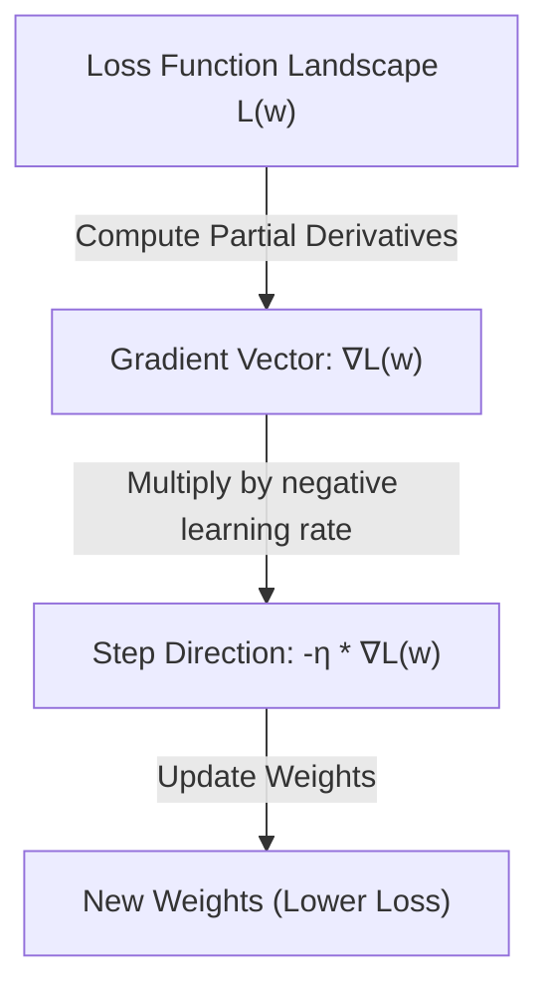

**Practical example:**
Let $f(x, y) = 3x^2 + 2y^3$.
The partial derivatives are:
$$\frac{\partial f}{\partial x} = 6x, \quad \frac{\partial f}{\partial y} = 6y^2$$
At point $(x=2, y=1)$, the gradient vector is:
$$\nabla f(2, 1) = [6(2), 6(1)^2]^T = [12, 6]^T$$
To decrease the function value as quickly as possible, we should move in the opposite direction: $[-12, -6]^T$.

**Why it matters:** Without gradients, optimization in high-dimensional spaces would be computationally impossible. Gradients allow us to update billions of parameters simultaneously without performing expensive, random grid searches.

---

### 0.0.3 — Gradient descent — how a model adjusts weights step-by-step

**Simple explanation:** Imagine you are playing a game where you have to find the lowest point of a bowl blindfolded. You tap your foot around to find which way slopes downward, take a small step in that direction, and repeat. If you take steps that are too big, you might overshoot the bottom and climb up the other side. If your steps are too small, it will take you forever to reach the bottom.

**How it works:** Gradient Descent is an iterative optimization algorithm used to minimize a loss function $L(\theta)$ parameterized by model weights $\theta$. The update rule is formulated as:
$$\theta_{t+1} = \theta_t - \eta \nabla_\theta L(\theta_t)$$
where $\eta$ is the learning rate.
In practice, vanilla gradient descent is rarely used because computing the loss over the entire dataset (Batch Gradient Descent) is too slow. Instead, we use Stochastic Gradient Descent (SGD) which updates parameters using a single random sample, or Mini-batch Gradient Descent, which strikes a balance by calculating gradients over a small batch (e.g., 32 to 512 samples). Modern optimizers like Adam (Adaptive Moment Estimation) build on this by keeping running averages of both the gradients (first moment) and their squares (second moment) to adaptively scale the learning rate for each parameter individually.

**Diagram:**
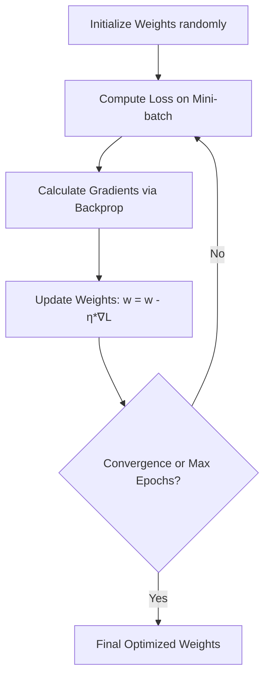

**Practical example:**
Assume a weight $w = 2.0$, learning rate $\eta = 0.1$, and a simple loss function $L(w) = w^2$.
The derivative of the loss is $\frac{dL}{dw} = 2w$.
At our current point, the gradient is $2 \times 2.0 = 4.0$.
We update the weight:
$$w_{new} = w - \eta \frac{dL}{dw} = 2.0 - 0.1 \times 4.0 = 1.6$$
The loss decreases from $4.0$ ($2.0^2$) to $2.56$ ($1.6^2$).

**Why it matters:** Gradient descent is the engine that drives neural network training. Choosing the right batch size, learning rate schedules, and optimizer variants directly impacts training convergence, stability, and total compute costs.

---

### 0.0.4 — Backpropagation in detail — how the error "travels backward" through the network

**Simple explanation:** Think of a multi-stage assembly line where a final product is built. At the end of the line, a quality inspector finds a defect. To fix the issue, the inspector goes backward along the line, telling each worker how much their specific action contributed to the final error so they can adjust their tools. Backpropagation is the mathematical way of tracing error backward through a network to assign credit or blame to every single weight.

**How it works:** Backpropagation is an efficient implementation of the mathematical Chain Rule used to calculate the gradient of a loss function with respect to all weights in a neural network. For a simple node sequence $x \to y \to z$ where $y = f(x)$ and $z = g(y)$, the derivative of $z$ with respect to $x$ is:
$$\frac{dz}{dx} = \frac{dz}{dy} \times \frac{dy}{dx}$$
In a neural network, during the forward pass, we compute activations and cache them. During the backward pass, we compute the loss gradient at the output, and then propagate it backward layer-by-layer. For a weight $w_{ij}^{[l]}$ connecting neuron $j$ in layer $l-1$ to neuron $i$ in layer $l$, the gradient is computed as:
$$\frac{\partial L}{\partial w_{ij}^{[l]}} = \delta_i^{[l]} a_j^{[l-1]}$$
where $\delta_i^{[l]} = \frac{\partial L}{\partial z_i^{[l]}}$ is the error term of neuron $i$ in layer $l$, calculated recursively from the next layer's error.

**Diagram:**
```mermaid
graph RL
    subgraph Backward Pass (Gradients)
        dLoss["dLoss/dy (Output Error)"] -->|Chain Rule| dHidden["dLoss/dh (Hidden Error)"]
        dHidden -->|Chain Rule| dWeights["dLoss/dw (Weight Gradients)"]
    end
    subgraph Forward Pass (Activations)
        Input["Input (x)"] -->|w1| Hidden["Hidden (h)"]
        Hidden -->|w2| Output["Output (y)"]
    end
```

**Practical example:**
Consider a single neuron: $z = w \cdot x$, and output activation $a = \sigma(z)$ where $\sigma$ is the sigmoid function. Let our target be $y$, and the loss be $L = \frac{1}{2}(a - y)^2$.
Using the chain rule to find $\frac{\partial L}{\partial w}$:
$$\frac{\partial L}{\partial w} = \frac{\partial L}{\partial a} \cdot \frac{\partial a}{\partial z} \cdot \frac{\partial z}{\partial w}$$
- $\frac{\partial L}{\partial a} = (a - y)$
- $\frac{\partial a}{\partial z} = \sigma(z)(1 - \sigma(z)) = a(1 - a)$
- $\frac{\partial z}{\partial w} = x$
Thus, $\frac{\partial L}{\partial w} = (a - y) \cdot a(1 - a) \cdot x$.

**Why it matters:** Backpropagation makes the gradient computation for millions of parameters highly efficient, running in $O(N)$ time complexity relative to the number of weights rather than $O(N^2)$ which numerical differentiation would require.

---

### 0.0.5 — Loss functions — how the error is measured numerically

**Simple explanation:** Imagine a driving instructor who scores your driving. If you drift slightly in your lane, they deduct a few points (Mean Squared Error). If you drive onto the sidewalk, they instantly fail you and stop the test (Cross-Entropy). A loss function is the mathematical scoring system that tells the neural network exactly how right or wrong its predictions are, defining the shape of the terrain it must navigate.

**How it works:** Loss functions map model predictions ($\hat{y}$) and true labels ($y$) to a non-negative scalar representing the cost of error.
1. **Mean Squared Error (MSE)** (for regression):
   $$L = \frac{1}{n} \sum_{i=1}^n (y_i - \hat{y}_i)^2$$
   MSE penalizes larger errors quadratically, making it highly sensitive to outliers.
2. **Binary Cross-Entropy (BCE)** (for binary classification):
   $$L = -\frac{1}{n} \sum_{i=1}^n [y_i \log(\hat{y}_i) + (1 - y_i) \log(1 - \hat{y}_i)]$$
   BCE penalizes confident but incorrect predictions exponentially.
3. **Categorical Cross-Entropy** (for multi-class classification):
   $$L = -\sum_{i} y_i \log(\hat{y}_i)$$
   This measures the divergence between the predicted probability distribution and the true target distribution.

**Diagram:**
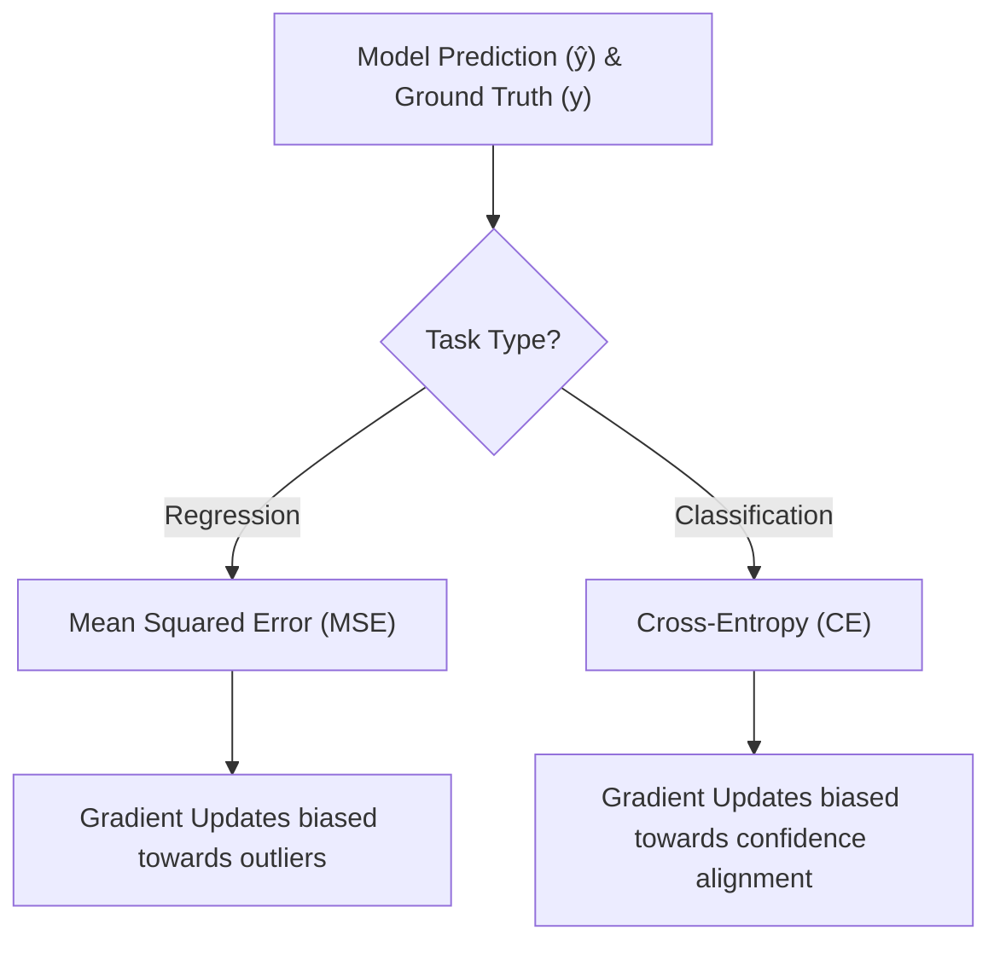

**Practical example:**
For a binary classification task, if the true label is $y = 1$ and the model predicts $\hat{y} = 0.9$:
$$L = -[1 \log(0.9) + 0 \log(0.1)] = -(-0.105) = 0.105$$
If the model confidently predicts incorrectly, $\hat{y} = 0.01$:
$$L = -[1 \log(0.01) + 0] = -(-4.605) = 4.605$$
The loss is over 40 times higher, forcing a massive gradient update.

**Why it matters:** Your choice of loss function directly defines what your model prioritizes during training. A poorly chosen loss function can lead to models that look statistically accurate but fail completely under real-world distributions.

---

### 0.0.6 — Classical ML pre-deep learning — regression, decision trees, SVM

**Simple explanation:** Imagine you are categorizing books. You can draw a straight line to separate fiction from non-fiction based on thickness (Linear Regression/Classification). Alternatively, you can follow a series of yes/no questions: "Does it have dragons? Yes -> Fantasy" (Decision Tree). Or, you can find the widest possible empty street that separates two opposing groups of people (Support Vector Machine). These are the classic, highly interpretable tools of machine learning.

**How it works:**
- **Linear/Logistic Regression:** Models relationships by fitting a linear equation to observed data. Logistic regression applies a sigmoid function to restrict output between 0 and 1 for classification.
- **Decision Trees:** Split data recursively based on features that maximize information gain (minimizing entropy or Gini impurity). Random Forests and Gradient Boosted Trees (like XGBoost) ensemble hundreds of these trees to reduce variance and bias.
- **Support Vector Machines (SVM):** Seek to find a hyperplane in an $N$-dimensional space that distinctly classifies data points by maximizing the margin between classes. SVMs use the "kernel trick" to implicitly project low-dimensional non-linear data into higher dimensions where it becomes linearly separable.

**Diagram:**
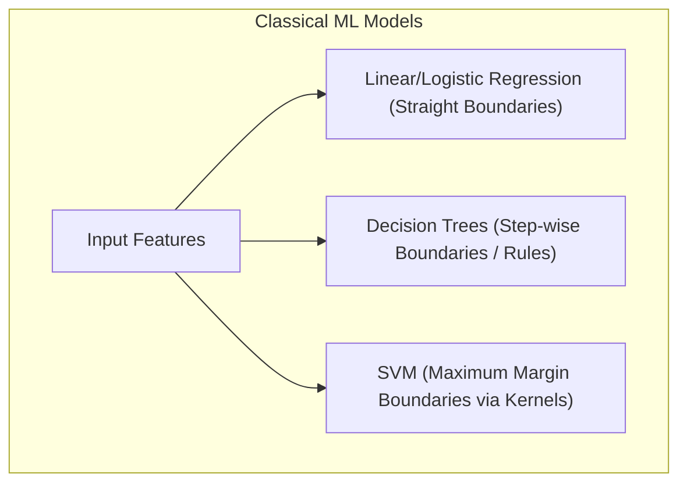

**Practical example:**
To find the optimal split in a Decision Tree for a dataset of 100 samples (50 Yes, 50 No), we compute the initial Shannon Entropy:
$$H(S) = - (0.5 \log_2 0.5 + 0.5 \log_2 0.5) = 1.0$$
If splitting on feature "Has Dragons" results in two clean subsets (50 Yes in one, 50 No in the other), the remaining entropy is $0.0$, yielding an Information Gain of $1.0 - 0.0 = 1.0$ (a perfect split).

**Why it matters:** Classic ML models require significantly less data, training time, and compute infrastructure than Deep Learning. For structured tabular data, models like XGBoost frequently outperform deep neural networks while remaining highly interpretable.

---

### 0.0.7 — Overfitting, underfitting e o bias-variance trade-off

**Simple explanation:** Think of studying for an exam. Underfitting is when you don't study enough and fail because you don't understand the basic concepts. Overfitting is when you memorize every single practice question word-for-word, but get completely confused on the real exam because the wording changed slightly. The bias-variance trade-off is the sweet spot where you understand the underlying concepts well enough to solve new, unseen questions.

**How it works:**
- **Bias:** Error introduced by approximating a complex real-world problem with a simple model (underfitting). High bias models fail to capture the data's underlying trend.
- **Variance:** Sensitivity of the model to small fluctuations in the training dataset (overfitting). High variance models capture random noise along with the underlying patterns, leading to poor generalization.
The total expected generalization error can be decomposed as:
$$\text{Total Error} = \text{Bias}^2 + \text{Variance} + \text{Irreducible Error}$$
As model complexity increases, bias decreases, but variance increases.

**Diagram:**
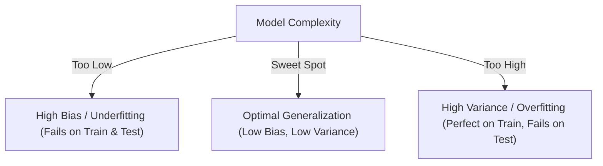

**Practical example:**
If we train a polynomial regression model on data generated by a quadratic function:
- $y = w_0 + w_1 x$ (Degree 1): Underfits. Training Mean Squared Error (MSE) is high ($15.2$), Test MSE is high ($16.1$).
- $y = w_0 + w_1 x + w_2 x^2$ (Degree 2): Fits perfectly. Training MSE ($1.1$), Test MSE ($1.2$).
- $y = w_0 + w_1 x + \dots + w_{10} x^{10}$ (Degree 10): Overfits. Training MSE is near zero ($0.1$), but Test MSE explodes ($124.5$) because the curve oscillates wildly to touch every training point.

**Why it matters:** Managing this trade-off is the central challenge of model training. It guides structural architecture choices, dataset sizing, and the integration of regularization strategies to ensure reliable real-world performance.

---

### 0.0.8 — Regularization — dropout, weight decay

**Simple explanation:** Imagine a sports team where one superstar player does absolutely everything, leaving the rest of the team weak and dependent. To fix this, the coach forces the superstar to sit out of random practices (Dropout), forcing all players to learn to coordinate. Additionally, the coach penalizes players who over-complicate their moves (Weight Decay), encouraging simple, efficient plays.

**How it works:** Regularization consists of techniques designed to prevent overfitting by restricting model capacity.
- **Weight Decay ($L_2$ Regularization):** Adds a penalty term proportional to the square of the weights to the loss function:
  $$L_{regularized} = L_{original} + \frac{\lambda}{2} \|\mathbf{w}\|^2_2$$
  This forces the optimization process to keep weight values small, preventing any single feature from dominating the network's predictions.
- **Dropout:** During each training step, random neurons are temporarily deactivated (set to zero) with a probability $p$ (typically $0.1$ to $0.5$). This prevents co-adaptation of features, forcing the network to learn redundant representations.

**Diagram:**
```mermaid
graph LR
    subgraph Standard Layer
        A[x1] --> B[h1]
        A --> C[h2]
        A --> D[h3]
    end
    subgraph Dropout Layer (p=0.33)
        E[x1] --> F[h1]
        E -.->|Dropped Out| G[h2]
        E --> H[h3]
    end
```

**Practical example:**
With Weight Decay ($\lambda = 0.01$), during gradient descent, the weight update becomes:
$$w_{t+1} = w_t - \eta \left( \frac{\partial L}{\partial w_t} + \lambda w_t \right) = (1 - \eta \lambda) w_t - \eta \frac{\partial L}{\partial w_t}$$
If learning rate $\eta = 0.1$, then before subtracting the gradient, the weight is scaled down by $(1 - 0.1 \times 0.01) = 0.999$, steadily decaying inactive weights toward zero.

**Why it matters:** Modern neural networks are highly over-parameterized and will easily memorize training noise without regularization. Applying these constraints is essential to guarantee robust model performance on unseen production data.

---

## Module 0 — Prehistory (until 2017): what came before the Transformer

### 0.1 — Symbolic AI, expert systems, and the "AI winters"

**Simple explanation:** Early AI was like a giant tax code book written by humans. It consisted of massive lists of rigid "if-then" rules written by human experts. If a situation didn't match the rules exactly, the system failed completely. When these systems failed to live up to their massive hype, funding vanished, leading to long periods of stagnation known as "AI winters."

**How it works:** Symbolic AI operates on the physical symbol system hypothesis, which states that thinking is the manipulation of explicit symbols using formal logical rules. Expert Systems utilized an **Inference Engine** to apply logical rules (forward or backward chaining) to a statically defined **Knowledge Base**.
For example:
$$\text{Rule 1: } \text{If } \text{Feathered}(x) \land \text{Flies}(x) \implies \text{Bird}(x)$$
$$\text{Rule 2: } \text{If } \text{Bird}(x) \land \text{Swims}(x) \implies \text{Penguin}(x) \quad (\text{Conflict!})$$
These systems lacked the ability to handle uncertainty, learn from raw data, or generalize beyond their hardcoded logic, leading to brittleness and failure in complex, real-world domains.

**Diagram:**
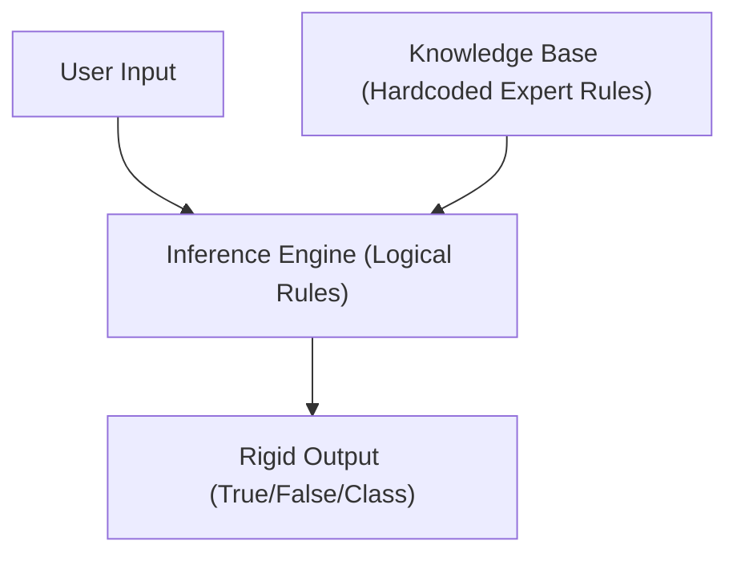

**Practical example:**
An early medical diagnostic system uses rules:
- `IF fever = True AND cough = True THEN diagnosis = Influenza (Confidence: 0.8)`
If a patient presents with a fever, cough, and a rare symptom not covered in the rules, the system fails to diagnose or defaults to a generic category, unable to perform soft statistical reasoning.

**Why it matters:** Understanding the limits of expert systems highlights why modern statistical machine learning succeeded. It reminds us that intelligent behavior is better emerged from learning from data patterns rather than manual rule writing.

---

### 0.2 — The shift to deep learning: perceptron, multi-layer networks

**Simple explanation:** A single perceptron is like a simple voting button: it sums up different inputs with weights, and if the total crosses a threshold, it turns on. However, a single button can only make simple decisions (like a straight line split). Deep learning stacks millions of these buttons into multiple layers, allowing the output of one layer to become the input for the next, which enables the network to recognize incredibly complex shapes and patterns.

**How it works:**
The single Perceptron (Rosenblatt, 1958) computes a weighted sum of inputs and applies a step function:
$$y = f(\sum_i w_i x_i + b)$$
It can only solve linearly separable problems (failing at basic functions like XOR).
Multi-Layer Perceptrons (MLPs) overcome this by adding hidden layers and replacing the step function with non-linear **activation functions** (like ReLU: $\max(0, x)$, or Sigmoid).
According to the **Universal Approximation Theorem**, an MLP with a single hidden layer containing a finite number of non-linear neurons can approximate any continuous function to arbitrary precision.

**Diagram:**
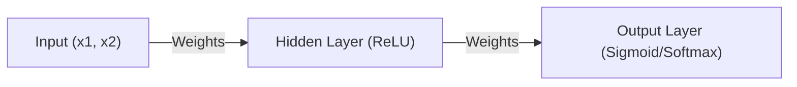

**Practical example:**
Let's see why a single perceptron cannot solve XOR (where outputs are $1$ only if inputs differ: $(0,1) \to 1$, $(1,0) \to 1$, $(0,0) \to 0$, $(1,1) \to 0$).
No single straight line $w_1 x_1 + w_2 x_2 + b = 0$ can separate the points $\{(0,0), (1,1)\}$ from $\{(0,1), (1,0)\}$.
An MLP resolves this by projecting inputs into a 3D hidden space where a plane can cleanly split the classes.

**Why it matters:** Multi-layer architectures with non-linear activation functions are the structural foundation of all modern deep learning models. Without non-linearity, stacking multiple layers would mathematically collapse into a single linear transformation.

---

### 0.3 — RNN (Recurrent Neural Networks) — processing sequences

**Simple explanation:** Imagine reading a sentence where you forget every word the instant you look at the next one. You wouldn't be able to understand the sentence at all. Recurrent Neural Networks (RNNs) solve this by having a loop that carries a "mental note" (hidden state) from the previous word to the current word, allowing the model to maintain memory of what came before.

**How it works:** Unlike feedforward networks that process inputs independently, RNNs process sequential data step-by-step, passing a hidden state $h_t$ along the sequence.
The formula for the hidden state update at time step $t$ is:
$$h_t = \tanh(W_{hh} h_{t-1} + W_{xh} x_t + b_h)$$
The output at step $t$ is:
$$y_t = \text{softmax}(W_{hy} h_t + b_y)$$
Here, the same weight matrices $W_{hh}$ and $W_{xh}$ are shared across all time steps, allowing the network to process variable-length inputs.

**Diagram:**
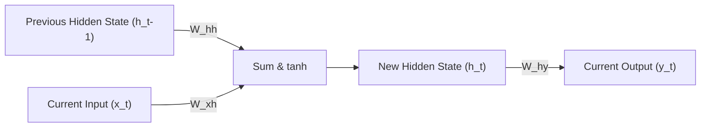

**Practical example:**
Processing the phrase "AI is great" step-by-step:
1. $t=1$: Input $x_1 = \text{"AI"}$. Hidden state $h_1 = \tanh(W_{xh}\text{"AI"} + W_{hh}\mathbf{0})$.
2. $t=2$: Input $x_2 = \text{"is"}$. Hidden state $h_2 = \tanh(W_{xh}\text{"is"} + W_{hh}h_1)$.
3. $t=3$: Input $x_3 = \text{"great"}$. Hidden state $h_3 = \tanh(W_{xh}\text{"great"} + W_{hh}h_2)$.
The final state $h_3$ acts as a compressed vector summary of the entire phrase.

**Why it matters:** RNNs introduced native handling of sequential structures (like text, time-series, or audio). However, their sequential design limits parallel computation during training, presenting a major hardware scaling bottleneck.

---

### 0.4 — LSTM (1997) — the vanishing/exploding gradient problem

**Simple explanation:** As a story gets longer, basic RNNs get "amnesia" and forget the beginning of the book because the influence of early words fades away during training. Long Short-Term Memory (LSTM) networks solve this by adding a "cell state" that acts like a protected conveyor belt. Special gates can write new information to the belt, read from it, or clear it, allowing important memories to travel safely across thousands of words.

**How it works:**
Standard RNNs suffer from **vanishing or exploding gradients** because training backpropagates gradients through time by repeatedly multiplying the recurrent weight matrix $W_{hh}$. If eigenvalues of $W_{hh}$ are $<1$, gradients vanish exponentially; if $>1$, they explode.
LSTMs (Hochreiter & Schmidhuber, 1997) resolve this using a **Cell State** ($C_t$) regulated by three multiplicative gates:
1. **Forget Gate ($f_t$):** Controls how much of the past cell state to discard.
   $$f_t = \sigma(W_f \cdot [h_{t-1}, x_t] + b_f)$$
2. **Input Gate ($i_t$):** Decides which new information to store in the cell state.
   $$i_t = \sigma(W_i \cdot [h_{t-1}, x_t] + b_i)$$
3. **Output Gate ($o_t$):** Determines what the next hidden state ($h_t$) should be.
   $$o_t = \sigma(W_o \cdot [h_{t-1}, x_t] + b_o)$$
The cell state is updated linearly, which allows gradients to flow backward through time without vanishing:
$$C_t = f_t * C_{t-1} + i_t * \tilde{C}_t$$

**Diagram:**
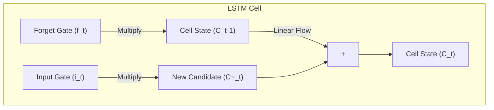

**Practical example:**
If a model reads: "The **books** that I bought yesterday **are** expensive", when it reaches the verb "are", the forget gate has kept the plural context "books" intact along the cell state conveyor belt, allowing the network to select the plural "are" instead of singular "is".

**Why it matters:** LSTMs made it practical to train deep sequential networks over much longer sequence lengths. However, they still process tokens sequentially, which limits their training speed on modern parallel GPU architectures.

---

### 0.5 — AlexNet (2012) and the ImageNet Challenge — the "big bang" of modern deep learning

**Simple explanation:** For a long time, researchers tried to design hand-crafted rules to help computers recognize images (like looking for specific line angles). In 2012, a neural network named AlexNet crushed all competition in an image recognition contest by using a graphics card (GPU) to learn these features automatically from millions of raw images, triggering the modern explosion of Deep Learning.

**How it works:** Prior to AlexNet, computer vision relied heavily on manual feature extraction like SIFT or HOG. AlexNet (Krizhevsky et al.) proved that deep convolutional neural networks (CNNs) could learn superior hierarchical feature representations directly from raw pixel values.
Key architectural components of AlexNet:
- **GPU Training:** Implemented parallel training across two NVIDIA GTX 580 GPUs to handle the massive compute requirements.
- **ReLU Activation:** Replaced slower Sigmoid activations, which significantly accelerated gradient flow and reduced training times.
- **Dropout Regularization:** Used to prevent massive overfitting in its dense layers.
This design won the ImageNet competitive benchmark by a massive, unprecedented margin, reducing error rates from $26\%$ to $16\%$.

**Diagram:**
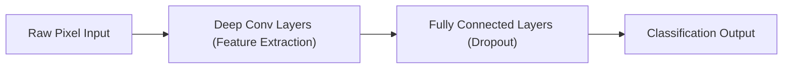

**Practical example:**
AlexNet demonstrated that lower convolutional layers automatically learn simple features (like edges, gradients, and textures), middle layers assemble these into parts (like wheels or eyes), and final layers group these parts into semantic concepts (like cars or dogs), all without any human hand-crafting features.

**Why it matters:** AlexNet shifted the AI industry from manual feature engineering to automatic representation learning. It established the paradigm of using specialized GPU hardware to train large, deep neural networks on massive datasets.

---

### 0.6 — Embeddings: Word2Vec and GloVe — meaning as a mathematical vector

**Simple explanation:** Computers do not understand words like "king" or "queen". To solve this, we translate words into a list of numbers (a vector) in a way that words with similar meanings are grouped close together in a high-dimensional space. In this mathematical world, the spatial relationships are so precise that you can literally calculate: "King - Man + Woman = Queen".

**How it works:** Word embeddings map words to dense vectors in a continuous multi-dimensional space, where words with similar semantic meanings or contexts are located near each other.
- **Word2Vec (Mikolov et al., 2013):** Trained on the task of predicting a word given its context (Continuous Bag of Words - CBOW) or predicting the context given a target word (Skip-gram). It utilizes negative sampling to make computing over massive vocabularies efficient.
- **GloVe (Global Vectors, Pennington et al., 2014):** Achieves similar vector spaces by factoring global word-word co-occurrence matrices, combining the advantages of global statistics with local context methods.

**Diagram:**
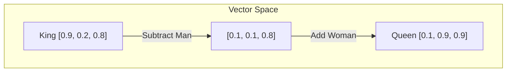

**Practical example:**
Using cosine similarity to measure vector alignment:
$$\text{Cosine Similarity}(\mathbf{u}, \mathbf{v}) = \frac{\mathbf{u} \cdot \mathbf{v}}{\|\mathbf{u}\| \|\mathbf{v}\|}$$
For vectors:
- $\mathbf{v}_{\text{cat}} = [0.8, 0.1, 0.3]$
- $\mathbf{v}_{\text{kitten}} = [0.75, 0.12, 0.28]$
- $\mathbf{v}_{\text{anvil}} = [-0.2, 0.5, -0.9]$
The similarity between "cat" and "kitten" is close to $0.98$, while similarity to "anvil" is near $-0.15$, mapping real-world semantics to spatial distance.

**Why it matters:** Embeddings are how modern models translate discrete human symbols into continuous mathematical representations that neural networks can process, compare, and manipulate.

---

### 0.7 — Seq2seq with attention (Bahdanau, 2014) — the conceptual seed of the Transformer

**Simple explanation:** Early translation systems processed a whole sentence, compressed it into a single "summary vector," and then tried to generate the translated sentence. This was like reading an entire page of text, closing the book, and trying to translate it from memory. The Bahdanau Attention mechanism solved this by letting the translator look back at specific words in the original sentence as it writes each translated word.

**How it works:**
The traditional Encoder-Decoder architecture compresses an input sequence into a single fixed-size context vector $v$, which acts as a major information bottleneck for long sequences.
Bahdanau Attention (2014) eliminated this bottleneck by calculating a dynamic context vector $c_i$ for each decoding step $i$.
The mechanism works as follows:
1. Compute alignment scores $e_{ij}$ comparing the current decoder state $s_{i-1}$ with all encoder hidden states $h_j$:
   $$e_{ij} = v_a^T \tanh(W_a s_{i-1} + U_a h_j)$$
2. Normalize these scores into attention weights $\alpha_{ij}$ using a softmax:
   $$\alpha_{ij} = \frac{\exp(e_{ij})}{\sum_k \exp(e_{ik})}$$
3. Compute the dynamic context vector $c_i$ as a weighted sum of the encoder hidden states:
   $$c_i = \sum_{j} \alpha_{ij} h_j$$

**Diagram:**
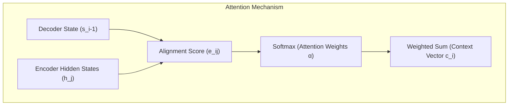

**Practical example:**
When translating "La jeune fille" to "The young girl":
While translating the word "girl", the attention mechanism assigns its highest weight (e.g., $0.85$) to the encoder state for "fille", allowing the model to focus on the noun despite structural word-order differences.

**Why it matters:** This was the critical conceptual breakthrough that proved neural networks could learn to dynamically align and focus on specific parts of an input sequence, laying the foundation for the Transformer.

---

### 0.8 — Why RNNs/LSTMs held back scaling — the bottleneck of sequentiality

**Simple explanation:** RNNs and LSTMs are like a team of builders where each worker must wait for the previous worker to finish their brick before they can lay the next one. You cannot speed this up by hiring more workers, because the process is fundamentally sequential. This sequential dependency made it impossible to leverage massive GPU clusters, creating a hard limit on how fast we could train models on big data.

**How it works:**
The core limitation of recurrent architectures is their sequential nature: computing the hidden state $h_t$ requires the completion of $h_{t-1}$.
$$h_t = f(h_{t-1}, x_t)$$
This recurrent dependency introduces two critical bottlenecks:
1. **No Temporal Parallelization:** During training, we cannot compute activations for step $t+100$ in parallel with step $t$. This means we cannot utilize the massive parallel processing power of modern GPUs/TPUs, limiting training speed.
2. **Memory Footprint:** To compute gradients with respect to early weights, Backpropagation Through Time (BPTT) requires keeping the entire sequence of hidden states in active memory, leading to severe memory constraints on long sequence lengths.

**Diagram:**
```mermaid
graph LR
    subgraph Sequential Bottleneck (RNN/LSTM)
        Step1["Step 1: h1"] --> Step2["Step 2: h2 (Must Wait)"] --> Step3["Step 3: h3 (Must Wait)"]
    end
```

**Practical example:**
If you try to train an LSTM on a sequence of 8,000 tokens, the GPU must perform 8,000 sequential matrix multiplications one after the other. It cannot process them in parallel, leaving thousands of GPU cores idle and wasting massive amounts of compute power.

**Why it matters:** This hardware-scaling bottleneck is what forced researchers to move away from recurrence. It drove the creation of the Transformer, which processes all tokens in parallel, unlocking the ability to scale models on massive datasets.

---

## Module 1 — The Transformer Architecture and Attention Mechanisms (2017–2019)

### 1.1 — "Attention Is All You Need" (2017) — the exact problem it solved

**Simple explanation:** The paper "Attention Is All You Need" solved the sequential bottleneck of RNNs by completely throwing away recurrence. Instead of processing text word-by-word, the Transformer processes the entire sentence at the exact same time. It uses attention mechanisms to allow every word to instantly look at and connect with every other word in the sentence, unlocking massive parallelization on modern GPU hardware.

**How it works:**
The Transformer paper (Vaswani et al., 2017) replaced recurrence entirely with self-attention. This design resolved two core issues:
1. **Parallel Training:** Because there are no recurrent loops, the activations for all tokens in a sequence can be computed in parallel during training.
2. **Constant Path Length:** In recurrent networks, information must travel through $O(N)$ sequential steps to connect two distant tokens. The Transformer connects any two tokens in a sequence in a single step ($O(1)$ path length), preventing information loss over long contexts.

**Diagram:**
```mermaid
graph TD
    subgraph Parallel Processing (Transformer)
        Input["All Tokens: [The, cat, sat]"] --> AttentionLayer["Self-Attention Layer (Parallel)"]
        AttentionLayer --> Output["All Activations Computed in Parallel"]
    end
```

**Practical example:**
When training on a sentence of 512 tokens, a Transformer performs a single, highly parallelized matrix operation across the entire sequence. The GPU executes this in parallel across thousands of cores, finishing in a fraction of the time a sequential model would require.

**Why it matters:** This architecture unlocked massive scale, making it possible to train models on web-scale datasets. It is the core architectural foundation of all modern Large Language Models (LLMs).

---

### 1.2 — Self-attention — Query, Key, Value

**Simple explanation:** Think of self-attention like a filing cabinet search. You have a search term in your mind (the Query). In the cabinet, each folder has a label on the tab (the Key) and contents inside (the Value). To find the right information, you compare your Query against all Keys to see which folders are relevant (Attention Weights), and then you pull and combine the contents (Values) of those folders.

**How it works:**
Self-attention maps an input sequence of vectors to an output sequence by allowing each token to dynamically focus on other tokens.
For an input matrix $X$, we project it into three spaces using learned weight matrices $W_Q, W_K, W_V$:
$$Q = XW_Q, \quad K = XW_K, \quad V = XW_V$$
The **Scaled Dot-Product Attention** is defined as:
$$\text{Attention}(Q, K, V) = \text{softmax}\left( \frac{QK^T}{\sqrt{d_k}} \right) V$$
- $QK^T$ computes similarity scores between all queries and keys.
- Dividing by $\sqrt{d_k}$ (where $d_k$ is the key dimension) scales the dot products to prevent softmax gradients from vanishing.
- Softmax normalizes these scores into a probability distribution (attention weights).
- Multiplying by $V$ computes a weighted sum of the values, representing the context-enriched token representations.

**Diagram:**
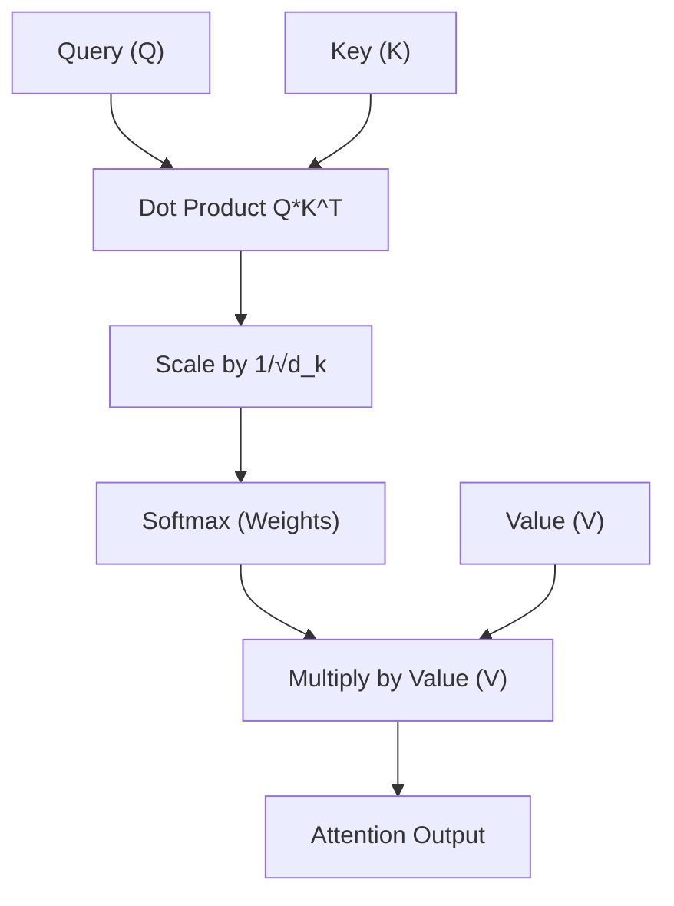

**Practical example:**
For a sequence of two tokens: "Fly" (noun/verb ambiguity) and "high".
Let $Q_{\text{Fly}} = [1.0, 0.0]$, $K_{\text{high}} = [0.9, 0.1]$, and $d_k = 2$.
The dot product $Q_{\text{Fly}} \cdot K_{\text{high}} = 0.9$.
Dividing by $\sqrt{2} \approx 1.41$ yields $0.638$.
Applying softmax across all keys determines how much "Fly" should focus on "high" to resolve its semantic meaning in context.

**Why it matters:** Self-attention allows tokens to dynamically build contextual representations based on their surroundings, which is the key mechanism behind the deep semantic understanding of LLMs.

---

### 1.3 — Multi-head attention — why "multiple heads"

**Simple explanation:** If you read a book looking only for clues in a mystery, you might miss the relationships between characters. Multi-head attention gives the model multiple independent "eyes" (heads). One head might focus on tracking grammar rules, another on pronoun references (who "he" refers to), and another on the emotional tone, combining all these different viewpoints into a complete understanding.

**How it works:**
Instead of computing attention once over the full vector dimension $d_{\text{model}}$, Multi-Head Attention projects the Queries, Keys, and Values $h$ times into lower-dimensional spaces of size $d_k = d_{\text{model}} / h$.
This allows the model to jointly attend to information from different representation subspaces at different positions.
$$\text{MultiHead}(Q, K, V) = \text{Concat}(\text{head}_1, \dots, \text{head}_h) W^O$$
$$\text{where} \quad \text{head}_i = \text{Attention}(Q W_i^Q, K W_i^K, V W_i^V)$$
Each head learns distinct projection matrices, enabling them to focus on different structural and semantic relationships in the sequence simultaneously.

**Diagram:**
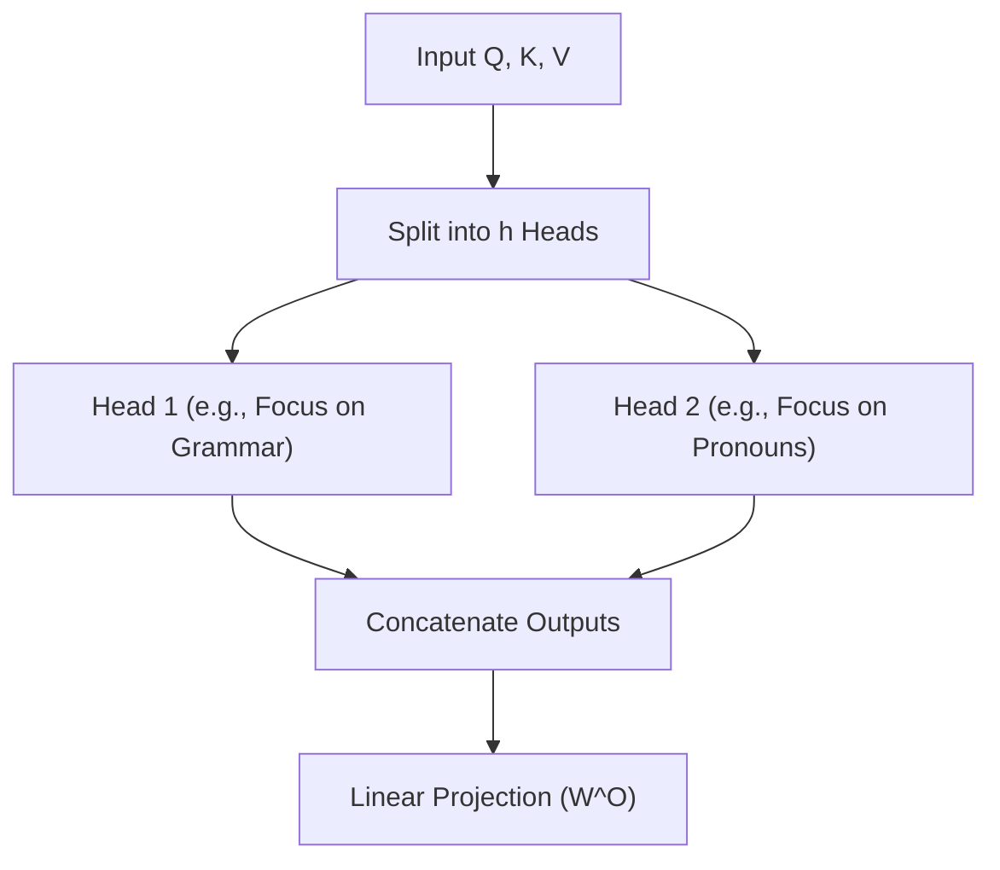

**Practical example:**
In the sentence "The dog didn't cross the street because it was too tired":
- Head 1 might connect "it" to "dog" (pronoun resolution).
- Head 2 might connect "it" to "tired" (state attribution).
- Head 3 might connect "cross" to "street" (verb-object relationship).
Combining these heads allows the model to build a complete semantic map of the sentence.

**Why it matters:** Multi-head attention prevents the attention mechanism from getting dominated by a single relationship, allowing the model to capture complex, multi-layered patterns in parallel.

---

### 1.4 — Positional encoding — how the model knows the order without recurrence

**Simple explanation:** Because the Transformer processes all words at the same time, it is naturally blind to word order. To the model, "dog bites man" and "man bites dog" look exactly the same. To fix this, we stamp a unique mathematical "timestamp" (positional encoding) onto each word vector before feeding it to the model, allowing it to easily read the sequence order.

**How it works:**
Since self-attention is permutation-invariant, the Transformer requires explicit positional information injected into its inputs.
This is achieved by adding a positional encoding vector $PE$ directly to the input token embedding vector $E$:
$$X = E + PE$$
The original paper uses sinusoidal functions of different frequencies to generate these encodings:
$$PE_{(pos, 2i)} = \sin\left(\frac{pos}{10000^{2i/d_{\text{model}}}}\right)$$
$$PE_{(pos, 2i+1)} = \cos\left(\frac{pos}{10000^{2i/d_{\text{model}}}}\right)$$
This design allows the model to easily learn and extrapolate relative positions, as $PE_{pos+k}$ can be represented as a linear transformation of $PE_{pos}$.

**Diagram:**
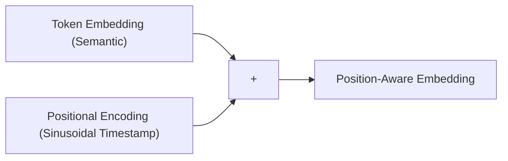

**Practical example:**
For a token at position $pos=3$ in a model with $d_{\text{model}}=4$:
- $PE_{(3, 0)} = \sin(3 / 10000^0) = \sin(3) \approx 0.141$
- $PE_{(3, 1)} = \cos(3 / 10000^0) = \cos(3) \approx -0.990$
- $PE_{(3, 2)} = \sin(3 / 10000^{0.5}) = \sin(0.03) \approx 0.030$
- $PE_{(3, 3)} = \cos(3 / 10000^{0.5}) = \cos(0.03) \approx 0.999$
The resulting vector $[0.141, -0.990, 0.030, 0.999]$ is added to the token embedding, uniquely identifying its position in the sequence.

**Why it matters:** Choosing the right positional encoding scheme (like modern Rotary Position Embeddings - RoPE) directly determines how well a model can extrapolate to longer context lengths during inference.

---

### 1.5 — Complete architecture: attention blocks, feed-forward, normalization, residuals

**Simple explanation:** Think of a Transformer block as a highly structured assembly line. Raw materials (embeddings) enter, are processed by a search committee (Self-Attention), and the results are refined individually (Feed-Forward network). To keep the assembly line stable, we use bypass paths (Residual Connections) to prevent losing original information, and standardize the values at each step (Layer Normalization) to keep things from spinning out of control.

**How it works:**
A complete Transformer layer consists of two main sub-layers: a Multi-Head Attention block and a Position-wise Feed-Forward Network (FFN).
To ensure training stability, each sub-layer is wrapped in a **Residual Connection** and followed by **Layer Normalization (LayerNorm)**.
The standard formulation (Post-LN) is:
$$x^{(1)} = \text{LayerNorm}(x + \text{MultiHeadAttention}(x))$$
$$x^{(2)} = \text{LayerNorm}(x^{(1)} + \text{FFN}(x^{(1)}))$$
- **Residual Connections:** Allow gradients to flow directly through the network without degradation, helping to mitigate vanishing gradient issues in deep networks.
- **LayerNorm:** Normalizes activations across the feature dimension for each token individually, stabilizing the hidden state distributions.
- **FFN:** Applies non-linear transformations to each token position independently: $\text{FFN}(x) = \max(0, xW_1 + b_1)W_2 + b_2$.

**Diagram:**
```mermaid
graph TD
    Input["Input Tensor"] --> MHA["Multi-Head Attention"]
    Input --> Residual1["Residual Path 1"]
    MHA --> AddNorm1["Add & LayerNorm"]
    Residual1 --> AddNorm1
    AddNorm1 --> FFN["Feed-Forward Network"]
    AddNorm1 --> Residual2["Residual Path 2"]
    FFN --> AddNorm2["Add & LayerNorm"]
    Residual2 --> AddNorm2
    AddNorm2 --> Output["Output Tensor to Next Layer"]
```

**Practical example:**
In a deep model with 32 layers, residual connections act as a direct highway. During backpropagation, a gradient can travel from Layer 32 to Layer 1 through the residual paths without being continuously multiplied by sub-layer weight matrices, preventing vanishing gradients.

**Why it matters:** The precise ordering of these blocks (e.g., Pre-LN vs. Post-LN) and the design of the normalization layers directly determine how deep a model can be trained before encountering instability or divergence.

---

### 1.6 — Three philosophies: Encoder-only (BERT), Decoder-only (GPT), Encoder-Decoder (T5)

**Simple explanation:** Depending on the task, we build Transformers differently. If you need to understand an entire text at once (like classification), you use an **Encoder-only** model that looks in both directions. If you want to write text word-by-word, you use a **Decoder-only** model that is strictly forbidden from looking at future words. If you want to translate or summarize, you use a hybrid **Encoder-Decoder** that reads the source text with one part and writes the translation with the other.

**How it works:**
1. **Encoder-only (e.g., BERT):** Uses bidirectional self-attention, where every token can look at all other tokens in the sequence. Highly effective for extraction, classification, and sequence labeling.
2. **Decoder-only (e.g., GPT):** Uses **causal masking** in its self-attention layer to prevent tokens from looking at future tokens (tokens to their right). This is essential for autoregressive text generation.
3. **Encoder-Decoder (e.g., T5, BART):** The encoder processes the input sequence bidirectionally, and its outputs are passed to the decoder. The decoder uses causal self-attention and cross-attention to generate the target sequence step-by-step, ideal for translation and summarization.

**Diagram:**
```mermaid
graph TD
    subgraph Transformer Architectures
        A["Encoder-Only (BERT) <br> Bidirectional Attention"]
        B["Decoder-Only (GPT) <br> Causal Masked Attention"]
        C["Encoder-Decoder (T5) <br> Bidirectional + Causal + Cross-Attention"]
    end
```

**Practical example:**
In a Decoder-only model, when processing "The cat sat", the attention mask is a lower-triangular matrix:
$$\begin{pmatrix} 
1 & 0 & 0 \\ 
1 & 1 & 0 \\ 
1 & 1 & 1 
\end{pmatrix}$$
This mask prevents the word "cat" (row 2) from attending to "sat" (column 3), ensuring the model only learns to predict the next word using past context.

**Why it matters:** Selecting the right architectural pattern is the first decision in designing an AI system, as it determines the model's efficiency and capabilities for classification, extraction, or generation tasks.

---

### 1.7 — Tokenization: BPE, WordPiece, SentencePiece

**Simple explanation:** Models cannot process raw text directly. Instead of splitting text by whole words (which would create a massive, unmanageable vocabulary) or by individual letters (which would lose too much meaning), we break text into small, common word fragments called subwords. This allows the model to understand common words instantly while still being able to spell out rare or new words.

**How it works:**
Subword tokenization algorithms build a vocabulary of optimal size by balancing character-level and word-level representations.
- **BPE (Byte Pair Encoding):** Starts with individual characters and iteratively merges the most frequent adjacent symbol pairs in the training corpus until the target vocabulary size is reached.
- **WordPiece:** Similar to BPE, but selects symbol merges that maximize the likelihood of the training data according to a unigram language model.
- **SentencePiece:** Treats the input as a raw byte stream (retaining spaces as explicit characters, e.g., `_`), removing the need for language-specific pre-tokenizers, making it highly effective for multilingual training.

**Diagram:**
```mermaid
graph LR
    RawText["Raw Text: unhelpful"] --> Tokenizer["Subword Tokenizer"]
    Tokenizer --> Tokens["Tokens: un, help, ful"]
    Tokens --> IDs["Token IDs: 1420, 3105, 789"]
```

**Practical example:**
Applying BPE training to a small corpus:
Initial vocab: `{u, n, h, e, l, p, f, s}`
If the word "help" appears 10,000 times, BPE will quickly merge:
1. `h` + `e` $\to$ `he`
2. `he` + `l` $\to$ `hel`
3. `hel` + `p` $\to$ `help`
If "unhelpful" is encountered during inference, the tokenizer splits it into `un`, `help`, and `ful`, successfully handling out-of-vocabulary words without failing.

**Why it matters:** Tokenization design directly impacts multilingual performance, vocabulary size, and the efficient utilization of the model's limited context window.

---

### 1.8 — What exactly is a "token" — why "strawberry" confuses models

**Simple explanation:** A token is the basic unit of text that a model reads, usually representing about 4 characters or 0.75 words. Models struggle with words like "strawberry" because the tokenizer breaks it into weird chunks like "straw", "ber", and "ry". Because the model only sees these abstract chunks as IDs, it cannot "see" the individual letters, which is why it gets confused when you ask it how many "r"s are in "strawberry".

**How it works:**
A token is a numerical ID corresponding to an entry in the model's embedding vocabulary.
When a user inputs text, the tokenizer maps text fragments to these IDs.
For example, the word "strawberry" might be tokenized as:
`["straw", "ber", "ry"]` $\to$ `[12043, 4012, 381]`
Because the Transformer's attention layers only process these high-level token IDs, the network has no direct access to the character-level spelling of the word. To count the letter "r", the model must rely on statistical patterns associated with those token IDs rather than direct character-level inspection.

**Diagram:**
```mermaid
graph TD
    Text["Word: strawberry"] --> Tokenizer["Tokenizer"]
    Tokenizer --> Fragments["Fragments: straw, ber, ry"]
    Fragments --> IDs["IDs: 12043, 4012, 381"]
    IDs --> Model["Model Core Transformer Layers without character visibility"]
```

**Practical example:**
If we ask an LLM: "How many letters are in 'strawberry'?"
The model processes:
`Token 12043 ("straw") + Token 4012 ("ber") + Token 381 ("ry")`
It must use its trained weights to "remember" the spelling of each token fragment and sum up the letters, which often leads to errors on words with irregular tokenization splits.

**Why it matters:** Understanding tokenization is critical when designing prompts, calculating API costs, and troubleshooting model failures on tasks involving spelling, arithmetic, or highly structured code.

---

## Module 2 — Scale, Distributed Training, and the GPT Era (2019–2022)

### 2.1 — GPT-1 and GPT-2 — predicting the next word generalizes

**Simple explanation:** Early AI models were trained on specific tasks, like sentiment analysis or translation. GPT-1 and GPT-2 proved that if you train a sufficiently large model on a single, simple task—predicting the next word in a massive corpus of web text—it naturally develops the ability to translate, summarize, and answer questions without any specialized training.

**How it works:**
GPT-1 (Radford et al., 2018) established the **pre-train then fine-tune** paradigm, proving that unsupervised language modeling on diverse corpora serves as an excellent initialization for downstream tasks.
GPT-2 (2019) expanded on this by showing that larger models trained on raw web data (WebText) could perform **zero-shot task transfer** without any explicit fine-tuning.
By training on the objective:
$$P(x) = \prod_{i=1}^n P(x_i \mid x_1, \dots, x_{i-1})$$
the model learns to approximate the underlying distribution of human knowledge, allowing it to perform diverse tasks simply by conditioning its generation on specific prompts.

**Diagram:**
```mermaid
graph TD
    A["Raw Web Text Dataset"] --> B["Pre-training: Predict Next Word"]
    B --> C["Emergent Zero-Shot Capabilities (Translation, Q&A, Summarization)"]
```

**Practical example:**
To translate "The cat is black" to French without explicit training, we prompt the model with:
`Translate English to French: The cat is black -> Le chat est noir. The dog is white -> `
The model, trying to predict the next logical tokens based on its pre-trained patterns, naturally completes the sequence with `Le chien est blanc`.

**Why it matters:** This shift marked the transition from task-specific architectures to general-purpose foundation models, establishing next-token prediction as the core training paradigm for modern generative AI.

---

### 2.2 — GPT-3 (2020) — the scale jump and "emergent" capabilities

**Simple explanation:** GPT-3 was essentially the same architecture as GPT-2, but scaled up to be over 100 times larger (175 billion parameters). This massive scale jump unlocked "emergent" capabilities—abilities like basic coding, logical reasoning, and complex translation that simply did not exist in smaller models, proving that quantity can have a quality of its own in AI.

**How it works:**
GPT-3 (Brown et al., 2020) scaled the decoder-only Transformer to 175 billion parameters across 96 layers.
This scale unlocked highly robust **In-Context Learning (ICL)**, allowing the model to adapt to new tasks instantly via prompt engineering (few-shot prompting) without any parameter updates or fine-tuning.
"Emergent abilities" are capabilities that are not present in smaller models but appear suddenly as parameter count, dataset size, and training compute cross specific scale thresholds, often due to the non-linear relationship between token-level accuracy and task-level success.

**Diagram:**
```mermaid
graph TD
    A["Compute Scale (FLOPs)"] -->|Crosses Threshold| B["Emergent Abilities (Logic, Reasoning, Basic Code)"]
```

**Practical example:**
When prompted to solve a complex logical puzzle, a 1.5B parameter model (GPT-2) outputs incoherent gibberish. GPT-3 (175B), utilizing its scaled contextual representation space, successfully breaks down the prompt and follows the logical constraints to output the correct answer.

**Why it matters:** GPT-3 proved that scaling parameters and data is a reliable way to unlock advanced capabilities, establishing foundation models as general-purpose platforms for a wide range of downstream applications.

---

### 2.3 — Scaling laws — Kaplan (2020) e Chinchilla (2022)

**Simple explanation:** Building state-of-the-art AI is incredibly expensive, so researchers wanted to know: if we double our budget, should we spend it on buying a bigger model or collecting more data? Early research suggested spending most of it on bigger models (Kaplan). However, a later study (Chinchilla) corrected this, showing that models and data must be scaled in equal proportions, proving that most early models were actually over-engineered and starved of data.

**How it works:**
Scaling laws provide empirical power-law relationships predicting model performance (cross-entropy loss $L$) as a function of three variables: compute ($C$), dataset size ($D$), and parameter count ($N$).
- **Kaplan et al. (OpenAI, 2020):** Suggested that model size should scale faster than dataset size.
  $$L(N, D) \approx \left(\frac{N_c}{N}\right)^{\alpha_N} + \left(\frac{D_c}{D}\right)^{\alpha_D}$$
- **Hoffmann et al. (DeepMind Chinchilla, 2022):** Corrected this by showing that for optimal compute allocation, $N$ and $D$ should scale in equal proportions. They proved that for every doubling of compute, both parameter count and training tokens should increase by approximately $1.15\times$.

**Diagram:**
```mermaid
graph TD
    subgraph TradeOff ["Compute Allocation Trade-off"]
        A["Compute Budget FLOPs"] --> B["Kaplan: Scale Parameters faster than Data"]
        A --> C["Chinchilla: Scale Parameters and Data equally"]
    end
```

**Practical example:**
To build a compute-optimal model given a fixed budget:
Instead of training a massive 175B model on 300B tokens (which is under-trained/data-starved), the Chinchilla scaling laws dictate that it is far more efficient to train a smaller 70B model on 1.4 Trillion tokens, yielding superior downstream performance for the same total training cost.

**Why it matters:** Scaling laws are the financial foundation of modern AI development, allowing companies to predict the performance of multi-million dollar training runs before launching them.

---

### 2.4 — Training data — Common Crawl, deduplication, synthetic data

**Simple explanation:** Training an LLM is like educating a student using the entire internet as a library. However, the raw internet is full of spam, duplicates, and toxic content. To build a great model, we must clean this library by removing duplicates, filtering out low-quality text, and occasionally creating high-quality "synthetic" textbooks written by other AI models to teach specific subjects like coding or logic.

**How it works:**
The quality of a foundation model is heavily determined by its training data.
The pipeline for processing raw internet data (like Common Crawl) includes:
1. **Filtering:** Using fast classifiers (like FastText) to remove low-quality text, adult content, and machine-generated spam.
2. **Deduplication:** Applying MinHash and LSH (Locality-Sensitive Hashing) at the document and paragraph level to prevent the model from memorizing repeated text.
3. **Synthetic Data Generation:** Generating high-quality, structured text using frontier models to train smaller models on specific reasoning or coding tasks, bypassing the scarcity of high-quality human data.

**Diagram:**
```mermaid
graph LR
    RawCC["Raw Common Crawl"] --> Filter["Quality Classifier"]
    Filter --> Dedup["MinHash Deduplication"]
    Dedup --> Synth["Mix in Synthetic Textbooks"]
    Synth --> TrainingCorpus["Clean Training Corpus"]
```

**Practical example:**
If a training dataset contains 500 identical copies of a specific licensing agreement, the model will waste capacity memorizing it. Deduplication identifies these duplicates using Jaccard similarity thresholds, retaining only a single copy and freeing up parameter capacity for general learning.

**Why it matters:** As we approach the physical limit of available human-generated text on the internet, data curation, quality filtering, and synthetic generation have become the primary battlegrounds for improving model performance.

---

### 2.5 — Training compute vs inference compute

**Simple explanation:** Training a model is like building a factory—it requires a massive upfront investment of millions of dollars in electricity and supercomputers. Running inferencing (asking the model questions) is like operating the factory to make individual products. While training happens once and consumes huge amounts of power, inferencing happens billions of times and must be highly optimized to be fast and cheap for millions of daily users.

**How it works:**
- **Training Compute:** A one-time, massive parallel operation characterized by high-throughput requirements. It is dominated by floating-point operations (FLOPs) during both forward and backward passes, utilizing FP32 or BF16 precision to maintain training stability.
- **Inference Compute:** A highly repetitive, latency-sensitive task that scales with the number of user requests. It involves only forward passes and is often memory-bandwidth bound rather than compute-bound, making model optimization (like quantizing weights to INT8 or INT4) critical to reduce VRAM requirements.

**Diagram:**
```mermaid
graph TD
    subgraph TrainingNode ["Training - High-Throughput"]
        Train["One-time Massive Compute: Forward and Backward Pass in BF16"]
    end
    subgraph InferenceNode ["Inference - Low-Latency"]
        Infer["Billions of Repetitions: Forward Pass only, Quantized to INT4 or INT8"]
    end
```

**Practical example:**
Training a 70B parameter model might require $10^{24}$ FLOPs, running for months across 4,000 GPUs.
In contrast, a single inference request to generate 100 tokens requires approximately $2 \times 70 \times 10^9 \times 100 \approx 1.4 \times 10^{13}$ FLOPs, taking less than a second on a single modern GPU node.

**Why it matters:** AI system designers must balance these two profiles. While a larger model might yield slightly higher accuracy, its increased inference latency and operational cost can make it impractical for real-time production deployment.

---

### 2.6 — FLOPs, parameters, and the real cost of training

**Simple explanation:** A parameter is a single "tuning knob" in a model's brain. A FLOP (Floating Point Operation) is a single mathematical calculation. To train a model, every single parameter must perform about 6 calculations (FLOPs) for every single word of training data. By multiplying these numbers, we can calculate the exact cost in electricity and GPU time needed to train any model.

**How it works:**
The total compute required to train a dense Transformer model can be estimated using a simple rule of thumb:
$$\text{Compute } (C) \approx 6 \times N \times D \quad \text{FLOPs}$$
where $N$ is the number of active parameters and $D$ is the number of training tokens.
- The forward pass requires approximately $2ND$ FLOPs (1 multiply-accumulate operation per parameter per token).
- The backward pass requires approximately $4ND$ FLOPs (double the compute of the forward pass to calculate gradients for both activations and weights).
Using this, we can calculate the hardware requirements and electrical costs based on target hardware throughput.

**Diagram:**
```mermaid
graph LR
    Forward["Forward Pass (2N FLOPs/token)"] --> Backward["Backward Pass (4N FLOPs/token)"]
    Backward --> Total["Total Training Compute: 6ND FLOPs"]
```

**Practical example:**
To train a 7B parameter model ($N = 7 \times 10^9$) on 2 Trillion tokens ($D = 2 \times 10^{12}$):
$$C \approx 6 \times (7 \times 10^9) \times (2 \times 10^{12}) = 8.4 \times 10^{22} \text{ FLOPs}$$
An NVIDIA H100 GPU has a theoretical BF16 throughput of $1.9 \times 10^{15}$ FLOPs/sec. At a realistic $40\%$ hardware utilization efficiency (MFU), one GPU delivers $7.6 \times 10^{14}$ actual FLOPs/sec.
The total GPU-seconds required is:
$$\frac{8.4 \times 10^{22}}{7.6 \times 10^{14}} \approx 110,526,315 \text{ seconds} \approx 1,279 \text{ GPU-days}$$
This allows us to estimate the training time (e.g., 12.8 days on a cluster of 100 H100 GPUs) and its exact capital cost.

**Why it matters:** This calculation is the first step in scoping any custom pre-training or fine-tuning run, allowing engineers to size GPU clusters and predict training budgets with high precision.

---

### 2.7 — Mixture-of-Experts (MoE) — routing, experts, scaling without skyrocketing costs

**Simple explanation:** Imagine a school with 8 specialized teachers (experts) and a principal (router) standing at the door. When a question comes in, the principal reads it and passes it only to the two teachers best suited to answer (e.g., math and history teachers), while the other teachers remain idle. Mixture-of-Experts allows us to build massive models with trillions of parameters that remain incredibly cheap and fast to run because only a small fraction of the model is activated for any given word.

**How it works:**
Mixture-of-Experts (MoE) replaces dense Feed-Forward Networks (FFN) with a set of $E$ independent FFN "experts".
A parameterized **Gating Network (Router)** $G(x)$ computes a routing probability distribution over these experts for each incoming token:
$$G(x) = \text{Softmax}(\text{KeepTopK}(x \cdot W_g, K))$$
where $K$ (typically 1 or 2) is the number of active experts selected per token.
The final output is the weighted sum of the active experts' outputs:
$$y = \sum_{i \in \text{TopK}} G(x)_i \cdot \text{Expert}_i(x)$$
This allows the model's total parameter count to scale up significantly while maintaining the computational profile of a much smaller model, as only a small subset of parameters is active per token.

**Diagram:**
```mermaid
graph TD
    Input["Input Token (x)"] --> Router["Router G(x)"]
    Router -->|Selects Expert 1 & 3| Expert1["Expert 1 (Active)"]
    Router -.->|Ignores Expert 2| Expert2["Expert 2 (Idle)"]
    Router --> Expert3["Expert 3 (Active)"]
    Expert1 --> Combine["Weighted Sum"]
    Expert3 --> Combine
    Combine --> Output["Output Tensor"]
```

**Practical example:**
Mixtral 8x7B has a total of 47 Billion parameters. However, because it routes each token to only 2 experts out of 8 at each layer, it only activates 13 Billion parameters per token. This gives it the processing speed and low inference cost of a 13B model while delivering the accuracy and capabilities of a much larger dense network.

**Why it matters:** MoE is the primary architectural strategy used to scale frontier models to trillion-parameter capacities while keeping real-time inference latency and operational hosting costs economically viable.

---

### 2.8 — In-context learning e few-shot prompting

**Simple explanation:** In-context learning is like showing a smart person a few examples of a task right on the spot, rather than sending them back to school. If you write: "Apple -> Red, Lime -> Green, Lemon -> ", the model recognizes the pattern and instantly completes it with "Yellow" simply by using its temporary working memory (the prompt context), without changing its permanent weights.

**How it works:**
In-Context Learning (ICL) is an emergent capability where a model learns to perform a task simply by conditioning on a prompt containing task descriptions and examples, without any weight updates.
This works by leveraging the self-attention layers to align the representation of the query token with the structural patterns provided in the few-shot examples.
The model does not learn new factual knowledge during this process; rather, it uses the context window to locate, activate, and format existing latent knowledge acquired during pre-training.

**Diagram:**
```mermaid
graph LR
    Prompt["Prompt: Examples + Query"] --> Model["Frozen LLM (No weight updates)"]
    Model --> Output["In-Context Completed Output"]
```

**Practical example:**
Few-shot prompting for sentiment classification:
```text
Review: "Loved the food!" | Sentiment: Positive
Review: "Service was slow." | Sentiment: Negative
Review: "The atmosphere was amazing, but cold." | Sentiment: 
```
The model processes the sequence. Its self-attention mechanism correlates the structure `Review: "[text]" | Sentiment:` to map the final query to `Mixed` or `Neutral`, completing the task on the fly without any gradient updates.

**Why it matters:** ICL allows developers to build highly customized, task-specific applications instantly via prompt engineering, bypassing the expensive data collection and compute pipelines required for traditional fine-tuning.

---

### 2.9 — InstructGPT (2022) — from text completion to following instructions

**Simple explanation:** Standard base LLMs are trained to simply complete sentences. If you ask a base model "How do I write a resume?", it might respond by writing a second question: "And how do I write a cover letter?", because that is how web pages are structured. InstructGPT solved this by aligning the model to behave as a helpful, direct assistant that actually follows instructions instead of just mimicking web page text.

**How it works:**
Base models trained purely on next-token prediction are often unhelpful or toxic because they mimic raw internet text.
InstructGPT (Ouyang et al., 2022) introduced a multi-stage pipeline to align models with human intent:
1. **Supervised Fine-Tuning (SFT):** Training the base model on a high-quality dataset of human-written instruction-response pairs.
2. **Reward Model (RM) Training:** Having humans rank multiple model outputs for a given prompt, and training a separate regression model to predict this human quality score.
3. **Reinforcement Learning from Human Feedback (RLHF):** Fine-tuning the SFT model using the PPO algorithm to maximize the reward predicted by the Reward Model.

**Diagram:**
```mermaid
graph TD
    Base["Base LLM (Predict Next Word)"] --> SFT["Supervised Fine-Tuning (Instruction Dataset)"]
    SFT --> RLHF["RLHF (PPO Optimization against Reward Model)"]
    RLHF --> Instruct["Instruct LLM (Helpful Assistant)"]
```

**Practical example:**
- **Base Model Input:** "Write a Python function to sort a list."
- **Base Model Output:** "...and explain its time complexity. This is a common interview question..." (continues to complete text).
- **Instruct Model Output:** "Here is the code: `def sort_list(lst): return sorted(lst)`" (directly follows instruction).

**Why it matters:** Instruction alignment was the critical bridge that made raw foundation models usable, safe, and intuitive for general consumer applications, paving the way for products like ChatGPT.

---

### 2.10 — RLHF — the mechanics of initial alignment

**Simple explanation:** Imagine training a dog using a clicker. When the dog does something good, you click and give it a treat. In RLHF, humans act as the judge to rate different model responses. We use these ratings to build a digital "dog trainer" (a Reward Model) that automatically scores the LLM's outputs, and we use reinforcement learning to guide the LLM's behavior towards responses that humans find helpful, accurate, and safe.

**How it works:**
Reinforcement Learning from Human Feedback (RLHF) optimizes an agent's policy (the LLM's weights $\theta$) using a Reward Model $R_\psi(x, y)$ that models human preferences.
The optimization objective is:
$$\text{obj}(\theta) = \mathbb{E}_{(x, y) \sim D_{\pi_\theta}} \left[ R_\psi(x, y) \right] - \beta \mathbb{D}_{\text{KL}}(\pi_\theta(y \mid x) \parallel \pi_{\text{SFT}}(y \mid x))$$
- **Reward Maximization:** Drives the model to generate highly-rated responses.
- **KL Divergence Penalty ($\mathbb{D}_{\text{KL}}$):** Prevents the active policy $\pi_\theta$ from drifting too far from the initial SFT policy $\pi_{\text{SFT}}$. Without this constraint, the model would exploit weaknesses in the Reward Model (reward hacking), leading to repetitive, unnatural, or gibberish outputs.

**Diagram:**
```mermaid
graph TD
    Prompt["Prompt x"] --> Policy["Active Policy: LLM Pi_Theta"]
    Policy --> Output["Response y"]
    Output --> RM["Reward Model R_x_y"]
    RM --> Score["Reward Score"]
    Score --> PPO["PPO Optimizer: Adjusts Weights"]
    Policy -->|KL Constraint| SFT["Original SFT Model"]
```

**Practical example:**
If a model discovers that starting every sentence with "As a helpful assistant, I..." artificially spikes the Reward Model's score, it will start doing it on every prompt. The KL penalty detects this rapid divergence from natural SFT patterns and penalizes the behavior, keeping outputs natural and balanced.

**Why it matters:** RLHF is the primary mechanism used to align raw statistical text generators with complex human values, ensuring safety, politeness, and structured correctness in production environments.

---

### 2.11 — Why a giant model does not fit on a single GPU — the physical baseline problem

**Simple explanation:** A modern graphics card (GPU) is like a super-fast desk with limited space (e.g., 80GB of VRAM). A massive model like GPT-3 has 175 billion weights. To train or run this model, we need to load not only these weights, but also the optimizer settings and the activation values for every word. Because this total memory footprint is several times larger than any single card's memory, we physically cannot fit the model onto a single GPU, forcing us to split it across networks of cooperative chips.

**How it works:**
The memory footprint of a model during training is significantly larger than its parameter count.
For a model with $N$ parameters trained using 16-bit precision (mixed precision) and the Adam optimizer:
1. **Model Parameters:** $2N$ bytes (FP16/BF16).
2. **Gradients:** $2N$ bytes (FP16/BF16).
3. **Optimizer States (Adam):** $12N$ bytes (FP32 master weights: $4N$, momentum: $4N$, variance: $4N$).
This yields a baseline of $16N$ bytes.
Additionally, we must allocate substantial memory for **activation memory** (cached intermediate values needed for the backward pass), which scales with batch size and sequence length.

**Diagram:**
```mermaid
graph TD
    subgraph GPU_VRAM ["GPU VRAM: 80GB Limit"]
        Params["Model Weights: 2 Bytes per parameter"]
        Gradients["Gradients: 2 Bytes per parameter"]
        OptState["Adam Optimizer States: 12 Bytes per parameter"]
        Activations["Activations and Working Memory"]
    end
```

**Practical example:**
For a 70B parameter model ($N = 70 \times 10^9$):
- Pure parameters require: $70 \times 10^9 \times 2 \text{ bytes} = 140 \text{ GB}$ (already exceeds a single standard 80GB H100 GPU).
- Training requires: $16 \times 70 \times 10^9 = 1,120 \text{ GB} = 1.12 \text{ TB}$ of premium high-bandwidth memory (HBM), requiring a minimum cluster of 14 interconnected 80GB GPUs just to fit the baseline training state.

**Why it matters:** Understanding memory constraints is critical for designing hosting infrastructure, calculating server node sizes, and implementing distributed training strategies.

---

### 2.12 — Data parallelism — copy the model, split the data

**Simple explanation:** Imagine you have a mountain of documents to read and summarize. To speed things up, you make copies of your summary guidelines, give a copy to 4 of your friends, divide the stack of documents equally among them, and have everyone work in parallel. At the end of the day, everyone meets to combine their findings. This is Data Parallelism: every GPU gets a full copy of the model but processes a different batch of data.

**How it works:**
Data Parallelism (DP) replicates the entire model across $K$ GPUs.
1. The input mini-batch is split into $K$ micro-batches, with each GPU receiving one micro-batch.
2. Each GPU performs an independent forward pass to compute activations and loss.
3. Each GPU performs an independent backward pass to compute local gradients.
4. Before updating weights, an **All-Reduce** communication operation is executed across all GPUs to average the gradients.
5. All GPUs update their local weights, ensuring the models remain synchronized.

**Diagram:**
```mermaid
graph TD
    subgraph DP ["Data Parallelism"]
        Data["Global Batch"] --> Split["Split Data"]
        Split --> GPU1["GPU 1: Model Copy"]
        Split --> GPU2["GPU 2: Model Copy"]
        GPU1 --> Grad1["Local Gradients 1"]
        GPU2 --> Grad2["Local Gradients 2"]
        Grad1 --> AllReduce["All-Reduce: Average Gradients"]
        Grad2 --> AllReduce
        AllReduce --> Update["Sync and Update Weights"]
    end
```

**Practical example:**
If we train a model with a global batch size of 1024 across 8 GPUs:
Each GPU receives a micro-batch of 128 samples, processes them locally to calculate gradients, and then averages its gradients with the other 7 GPUs before updating its parameters, speeding up the training step.

**Why it matters:** Data Parallelism is the most straightforward and efficient distributed training strategy, but it requires that the entire model, gradients, and optimizer states fit comfortably within the memory of a single GPU.

---

### 2.13 — Model parallelism — split the model itself

**Simple explanation:** When a model is too large to fit on a single GPU, we must split its internal math across multiple GPUs. Instead of copying the whole model, we cut the massive weight matrices into pieces (like splitting a huge math equation). One GPU calculates the first half of the multiplication, another GPU calculates the second half, and they quickly share their results to get the final answer.

**How it works:**
Model Parallelism (specifically Tensor Parallelism, popularized by Megatron-LM) splits individual weight matrices across multiple GPUs.
For a standard linear layer $Y = XW$:
- **Column Parallel Linear Layer:** We split $W$ column-wise: $W = [W_1 \mid W_2]$.
  Each GPU $i$ computes $Y_i = XW_i$ independently.
  An **All-Gather** operation is then performed to reconstruct the final output $Y = [Y_1 \mid Y_2]$.
- **Row Parallel Linear Layer:** We split $W$ row-wise: $W = \begin{bmatrix} W_1 \\ W_2 \end{bmatrix}$.
  The input $X$ is split column-wise: $X = [X_1 \mid X_2]$.
  Each GPU $i$ computes $Y_i = X_i W_i$.
  An **All-Reduce** sum operation is performed to compute $Y = Y_1 + Y_2$.

**Diagram:**
```mermaid
graph TD
    X["Input Tensor X"] --> GPU1["GPU 1 (Computes X * W_1)"]
    X --> GPU2["GPU 2 (Computes X * W_2)"]
    GPU1 --> AllGather["All-Gather Communication"]
    GPU2 --> AllGather
    AllGather --> Output["Final Combined Output Y"]
```

**Practical example:**
When implementing a massive multi-head attention projection layer:
Instead of forcing one GPU to compute all 32 attention attention heads, we split the projection matrix across 4 GPUs in a tensor-parallel configuration. Each GPU computes exactly 8 heads, and they perform an All-Reduce to combine their features before passing them to the next layer.

**Why it matters:** Tensor Parallelism is essential for training and serving extremely large models (e.g., >70B parameters) that physically cannot fit within the memory of a single hardware node.

---

### 2.14 — Pipeline parallelism — split the model into "layers"

**Simple explanation:** Think of an automotive assembly line. Instead of one worker building a whole car, the first worker builds the chassis (Layer 1-10 on GPU 1), passes it to the next worker who adds the engine (Layer 11-20 on GPU 2), and so on. While the second worker is adding the engine to car #1, the first worker is already building the chassis for car #2, keeping the line moving in pipeline stages.

**How it works:**
Pipeline Parallelism partitions a model's layers sequentially across $P$ GPUs.
GPU 1 holds layers $1$ to $L/P$, GPU 2 holds layers $L/P+1$ to $2L/P$, and so on.
To prevent GPUs from sitting idle while waiting for inputs from previous stages (known as the "pipeline bubble"), we use modern schedule designs like **1F1B (One Forward, One Backward)**:
1. The global batch is divided into smaller micro-batches.
2. GPUs process these micro-batches in a steady, staggered flow, executing one forward step followed by one backward step.
3. This keeps all GPUs continuously active, maximizing hardware utilization.

**Diagram:**
```mermaid
graph LR
    subgraph GPU1 ["GPU 1: Layers 1-10"]
        F1_1["Forward Pass: Batch 1"] --> F1_2["Forward Pass: Batch 2"]
    end
    subgraph GPU2 ["GPU 2: Layers 11-20"]
        F1_1 --> F2_1["Forward Pass: Batch 1"]
    end
```

**Practical example:**
When training a 96-layer model across 4 GPUs:
- GPU 1 is assigned layers 1-24.
- GPU 2 is assigned layers 25-48.
- GPU 3 is assigned layers 49-72.
- GPU 4 is assigned layers 73-96.
As soon as GPU 1 finishes processing the first micro-batch, it sends the activations to GPU 2 and immediately starts processing the second micro-batch, pipeline-scaling the workload.

**Why it matters:** Pipeline Parallelism allows scaling models across multiple physical nodes without requiring high-speed intra-node connections for every layer, serving as a key pillar of modern distributed training frameworks.

---

### 2.15 — ZeRO / DeepSpeed — reducing memory redundancy

**Simple explanation:** During standard parallel training, every GPU holds a redundant copy of the optimizer's settings and gradients, wasting massive amounts of precious memory. ZeRO (Zero Redundancy Optimizer) eliminates this waste by shredding these states into pieces and distributing them across the GPUs. When a GPU needs to perform a calculation, it quickly fetches the missing piece from its neighbor and deletes it immediately after use, freeing up memory to train much larger models.

**How it works:**
ZeRO (Rajbhandari et al., 2020) eliminates the memory redundancies of classical Data Parallelism while retaining its simple communication profile. It partitions training states across three progressive levels:
1. **ZeRO-Stage 1:** Partitions the optimizer states (saving up to $4\times$ memory).
2. **ZeRO-Stage 2:** Partitions both optimizer states and gradients (saving up to $8\times$ memory).
3. **ZeRO-Stage 3:** Partitions optimizer states, gradients, and model parameters (memory scaling scales linearly with the number of GPUs).
During the forward and backward passes, parameters are gathered dynamically via fast collective communication (All-Gather) and discarded immediately after computation.

**Diagram:**
```mermaid
graph TD
    subgraph StdDP ["Standard DP: Redundant"]
        GPU1["GPU 1: Full Params, Grads, Opt States"]
        GPU2["GPU 2: Full Params, Grads, Opt States"]
    end
    subgraph ZeRO3 ["ZeRO-Stage 3: Partitioned"]
        G1["GPU 1: 1/2 Params, Grads, Opt States"]
        G2["GPU 2: 1/2 Params, Grads, Opt States"]
    end
```

**Practical example:**
Using ZeRO-Stage 3 to train a 70B parameter model across 16 GPUs:
Instead of each GPU requiring $140\text{GB}$ of memory just to hold the model weights, each GPU holds exactly $\frac{140}{16} \approx 8.75\text{GB}$ of weights. During training, each layer's weights are gathered from the network on the fly as needed, computed, and immediately released, allowing massive models to be trained on standard hardware.

**Why it matters:** ZeRO-powered frameworks like DeepSpeed are the industry standard for training large models, enabling engineers to train larger models on existing GPU clusters without requiring specialized model parallelism code.

---

### 2.16 — GPU communication — the interconnect as the new bottleneck

**Simple explanation:** Having super-fast GPUs is useless if they spend most of their time waiting for files to transfer over a slow network cable. As models grow, GPUs must constantly share massive amounts of data with each other. The speed of the network cables connecting these cards (like NVLink inside a server, or InfiniBand between servers) is now the primary bottleneck determining how fast we can train AI.

**How it works:**
In distributed training, GPUs must constantly exchange parameters and gradients using collective communication operations:
- **All-Reduce:** Sums/averages vectors across all GPUs (used for gradient synchronization).
- **All-Gather:** Collects slices of a tensor from all GPUs to reconstruct the full tensor.
The speed of these operations is limited by the physical **interconnect bandwidth**:
1. **Intra-node (Inside a chassis):** Driven by specialized protocols like NVIDIA **NVLink** (up to 900 GB/s on modern architectures), bypassing slow PCIe buses.
2. **Inter-node (Between different chassis):** Requiring low-latency, high-bandwidth fabrics like **InfiniBand** or RoCE (RDMA over Converged Ethernet) running at 400 Gbps or higher.
If interconnect speeds are slow, GPUs spend most of their time idling during communication phases, drastically reducing overall training efficiency (MFU).

**Diagram:**
```mermaid
graph TD
    subgraph Node_A ["Server Node A"]
        GPU1["GPU 1"] <-->|NVLink: ultra-fast| GPU2["GPU 2"]
    end
    subgraph Node_B ["Server Node B"]
        GPU3["GPU 3"] <-->|NVLink: ultra-fast| GPU4["GPU 4"]
    end
    Node_A <-->|InfiniBand: fast network| Node_B
```

**Practical example:**
During an All-Reduce operation of a 7B parameter model's gradients ($14\text{GB}$ of data in FP16) across 8 nodes:
Using a standard ethernet connection ($10\text{ Gbps}$), this transfer takes over 11 seconds, causing massive training delays.
Using a dedicated InfiniBand fabric ($400\text{ Gbps}$), the same transfer completes in a fraction of a second, keeping the GPU cores continuously fed and active.

**Why it matters:** When designing or renting GPU clusters, network interconnect speed is often more critical than raw GPU compute power. A cluster with slow networking will fail to scale efficiently beyond a few nodes.

---

### 2.17 — Checkpointing and fault tolerance in long training

**Simple explanation:** Training an LLM for months is like running a massive marathon where runners frequently trip and fall. With thousands of GPUs running hot, hardware failures, power surges, or bad memory chips are guaranteed to happen every few days. Checkpointing is the process of periodically saving the entire model state to secure storage (like an autosave in a video game) so that when a chip inevitably fails, the training run can resume from the last save point rather than starting over.

**How it works:**
Large-scale training runs spanning weeks or months across thousands of GPUs have a low Mean Time Between Failures (MTBF).
To prevent losing millions of dollars of compute, training pipelines implement robust **checkpointing and fault tolerance frameworks** (like Megatron-LM Checkpointing or PyTorch Distributed Elastic):
- **Synchronous Checkpointing:** Periodically pauses training to write the complete model states, optimizer states, and dataloader positions to high-speed persistent storage (like Ceph or S3).
- **Asynchronous/In-Memory Checkpointing:** Spawns background worker threads to write the checkpoint state asynchronously while the main GPU threads immediately resume training.
- **Dynamic Cluster Re-routing:** Automatically detects failed hardware nodes, isolates them, and spins up replacement nodes to resume training from the latest checkpoint without human intervention.

**Diagram:**
```mermaid
graph TD
    Train1["Train Step 1000"] --> Train2["Train Step 2000"]
    Train2 --> Save["Write Checkpoint to S3 (Weights, Optimizer, DataLoader State)"]
    Save --> Train3["Train Step 3000"]
    Train3 --> Fail{"Hardware Node Fails!"}
    Fail --> Recovery["Isolate Node & Restart Cluster"]
    Recovery --> Reload["Reload Checkpoint Step 2000"]
    Reload --> TrainRecover["Resume Training"]
```

**Practical example:**
During a 30-day pre-training run on 2,048 GPUs, Node #42 experiences a hardware error (uncorrectable ECC memory error) at Step 15,450.
The training framework automatically pauses, releases the failed node, re-allocates a spare node, reloads the saved state from Step 15,000, and resumes training within 10 minutes, losing only a small fraction of compute rather than the entire run.

**Why it matters:** Designing robust checkpointing systems is essential for large-scale training, protecting massive financial investments and ensuring project timelines are met.

---

## Module 3 — Context, Memory, and Attention Windows

### 3.1 — Why the context window is limited — quadratic cost O(n²)

**Simple explanation:** Imagine reading a book where, to understand each new word, you must look back and compare it with every single word you’ve read since page one. If you have read 100 words, you perform 10,000 comparisons; if you have read 10,000 words, you perform 100,000,000 comparisons. This is why the context window is limited: as the input text gets longer, the calculations and memory required by the attention mechanism grow quadratically, quickly crashing the GPU.

**How it works:** In self-attention, we project the input matrix $X \in \mathbb{R}^{N \times d}$ into Query ($Q$), Key ($K$), and Value ($V$) matrices. We compute the attention scores via:
$$A = \text{softmax}\left(\frac{QK^T}{\sqrt{d_k}}\right)V$$
The matrix multiplication $QK^T$ requires multiplying an $N \times d_k$ matrix by a $d_k \times N$ matrix. This operation results in an $N \times N$ attention weight matrix. The computational complexity of this matrix multiplication is $O(N^2 \cdot d)$, and storing the resulting attention matrix in memory requires $O(N^2)$ space. For a sequence length of 100,000 tokens, the $N \times N$ matrix requires storing $10,000,000,000$ floats per attention head, consuming dozens of gigabytes of GPU VRAM per layer just to hold intermediate attention weights before applying the softmax.

**Diagram:**
```mermaid
graph TD
    subgraph Attention Bottleneck
        Tokens["Tokens (N)"] --> Q["Query: N x d"]
        Tokens --> K["Key: N x d"]
        Q --> Sim["QK^T Matrix: N x N Elements (Quadratic Space & Compute)"]
        K --> Sim
    end
```

**Practical example:**
For a model with $d_{\text{model}} = 4096$, $12$ attention heads ($d_k = 128$), and FP16 precision ($2$ bytes per float):
- At $N = 2,048$ tokens: $N \times N = 4.19 \times 10^6$ elements. Storing the attention matrix for 12 heads is: $4.19 \times 10^6 \times 12 \times 2 \text{ bytes} \approx 100 \text{ MB}$ of memory.
- At $N = 100,000$ tokens: $N \times N = 10^{10}$ elements. Memory required is: $10^{10} \times 12 \times 2 \text{ bytes} \approx 240 \text{ GB}$ of memory per layer.
This exceeds the physical memory capacity of even multiple connected high-end GPUs.

**Why it matters:** Designers must understand that native self-attention is mathematically bounded by quadratic scaling. Extending context lengths requires alternative architectures, specialized attention optimizations, or memory-efficient kernels.

---

### 3.2 — FlashAttention — optimizing without changing the mathematical output

**Simple explanation:** Imagine solving a massive math problem where you are forced to write down every intermediate step on a giant whiteboard, but the board is so far away that walking to it and back takes up $99\%$ of your time. FlashAttention is like learning to do all the intermediate steps in your head using a small, fast notepad on your desk, and only writing down the final, correct answer on the whiteboard. It mathematically outputs the exact same results as standard attention but works much faster by avoiding slow memory transfers.

**How it works:** FlashAttention (Dao et al.) addresses the memory bandwidth bottleneck of self-attention. Standard attention computes the $N \times N$ matrix $S = QK^T$, writes it to slow High-Bandwidth Memory (HBM), reads it back to compute Softmax, writes the weights $P$ to HBM, and reads them back to multiply by $V$. FlashAttention tiles the input matrices into blocks that fit entirely within the GPU's ultra-fast, local SRAM (on-chip cache). It computes attention block-by-block using **online softmax normalization** (re-scaling previous blocks' softmax denominators on the fly). During backpropagation, instead of storing the massive $N \times N$ intermediate attention matrix, FlashAttention recomputes the attention blocks on-the-fly from the cached activations, substituting cheap FLOPs for expensive HBM read/write operations.

**Diagram:**
```mermaid
graph TD
    subgraph GPU Memory Hierarchy
        HBM["Slow High-Bandwidth Memory (GBs)"]
        SRAM["Fast on-chip SRAM (MBs - Tile Cache)"]
        HBM -->|Load Tiles: Q, K, V| SRAM
        SRAM -->|Compute Block Softmax & Rescale| SRAM
        SRAM -->|Write Final Block Output: O| HBM
    end
```

**Practical example:**
In a standard attention execution, a GPU spends $90\%$ of its time idling, waiting for the memory bus to transfer the $N \times N$ matrix back and forth between HBM and the SM processors. FlashAttention reduces HBM accesses from $O(N^2)$ to $O(N)$, speeding up the overall attention computation by $2\times$ to $4\times$ on modern hardware like NVIDIA A100s while producing the mathematically identical outputs.

**Why it matters:** FlashAttention is a foundational software optimization for training and serving LLMs. It enables expanding context lengths without modifying the underlying model architecture, simply by improving hardware execution efficiency.

---

### 3.3 — RoPE and ALiBi — solutions for context extrapolation

**Simple explanation:** Imagine a music scale where each note is placed relative to the previous note. If you only train a singer to sing songs that are 5 notes long, they might struggle to sing an 8-note song because they don't know what the 6th note sounds like. Rotary Position Embeddings (RoPE) and Attention with Linear Biases (ALiBi) are mathematical systems that teach models relative distance rather than absolute position, allowing them to naturally understand long texts even if they were only trained on short ones.

**How it works:**
- **RoPE (Rotary Position Embedding):** Rotates the Query and Key vectors in the 2D complex plane by an angle proportional to their absolute sequence position $m$: $\mathbf{q}_m = \mathbf{R}_m \mathbf{q}$. The inner product $\langle \mathbf{q}_m, \mathbf{k}_n \rangle$ becomes a function of the relative distance $(m - n)$, allowing the model to naturally extrapolate to any context distance during inference without losing relative ordering.
- **ALiBi (Attention with Linear Biases):** Completely removes positional embeddings from the input. Instead, it subtracts a static, linear penalty proportional to the distance between the query and key directly from the attention score matrix:
$$A_{i,j} = \mathbf{q}_i \mathbf{k}_j^T - m(i - j)$$
where $m$ is a head-specific scalar slope.

**Diagram:**
```mermaid
graph LR
    subgraph RoPE ["RoPE: 2D Vector Rotation"]
        Q["Query Vector Q"] -->|Rotate by angle m*θ| Q_rot["Rotated Query Q_m"]
        K["Key Vector K"] -->|Rotate by angle n*θ| K_rot["Rotated Key K_n"]
        Q_rot & K_rot -->|Dot Product| Relative["Relative Distance (m-n) Interaction"]
    end
```

**Practical example:**
With RoPE, as the distance $d = (m-n)$ between two tokens increases, the rotation angles cause their vector dot products to naturally decay. This mirrors human reading patterns where immediate context is more relevant, enabling a model trained on a 4,000-token context length to maintain coherence and generalize to 32,000 tokens during inference.

**Why it matters:** Positional representation determines a model's capacity to extrapolate. System architects must choose RoPE for maximum precision (used in Llama and Mistral) or ALiBi for robust, zero-shot length scaling.

---

### 3.4 — The long context race (2023–2026): from 4K to 1M+ tokens

**Simple explanation:** Early LLMs were like goldfishes—they forgot what you wrote after a few pages of text (4,000 tokens). Over the last few years, a massive engineering race pushed this limit past 1 million tokens, allowing you to feed entire codebases, books, or movies directly into the model's active memory in a single prompt.

**How it works:** Scaling context to 1M+ tokens (e.g., Gemini, Llama-3) is made possible through a stack of distinct innovations:
1. **RoPE Base Frequency Scaling:** Modifying the base frequency $\theta$ of RoPE from $10,000$ to $500,000+$ to prevent angle overlap at long sequences.
2. **Sparse/Approximate Attention:** Utilizing sliding windows, block-sparse attention, or state-space model hybrids (like Mamba) to bypass the $O(N^2)$ bottleneck.
3. **Hardware Infrastructure Parallelism:** Splitting the context length dimension across multiple GPUs using **Sequence Parallelism** (e.g., Ring Attention), where each GPU calculates a segment of the sequence and passes intermediate values in a logical ring.

**Diagram:**
```mermaid
graph LR
    subgraph Ring_Attention ["Ring Attention Sequence Parallelism"]
        GPU1["GPU 1: Tokens 0-256k"] <-->|Send/Recv Activations| GPU2["GPU 2: Tokens 256k-512k"]
        GPU2 <-->|Send/Recv Activations| GPU3["GPU 3: Tokens 512k-768k"]
        GPU3 <-->|Send/Recv Activations| GPU4["GPU 4: Tokens 768k-1M"]
    end
```

**Practical example:**
To process a 1-million-token input, standard attention requires 2 Terabytes of memory to store a single activation state. By implementing Ring Attention, the sequence is split into 4 parts of 256k tokens across 4 GPUs. Each GPU computes its local attention and communicates ring-wise to compute global normalization, keeping peak VRAM per card below 80GB.

**Why it matters:** Long context models eliminate the need for complex, chunk-based RAG preprocessing. However, architects must evaluate if the massive computational cost of long context processing is commercially justified compared to efficient retrieval methods.

---

### 3.5 — Long context in practice: "lost in the middle"

**Simple explanation:** Imagine trying to find a specific sentence hidden somewhere inside a 500-page book. If the sentence is on page one or page 500, you will find it easily. But if it is on page 250, you might skim right past it because your brain gets tired in the middle. LLMs suffer from the exact same issue: they are excellent at retrieving information at the very beginning or end of their prompt, but struggle to "see" facts hidden in the middle of a massive context.

**How it works:** The "lost in the middle" phenomenon (Liu et al.) is a structural limitation of Transformer attention allocation. Because models are trained on sequential causal objectives where the beginning (system instructions) and the end (immediate query) are mathematically crucial for predicting the next token, the gradient signals during backpropagation favor these extremities. As a result, the attention weights assigned to tokens in the middle of long sequences naturally decay. This leads to a U-shaped performance curve where retrieval accuracy drops significantly when the target information is placed between $20\%$ and $80\%$ of the context length.

**Diagram:**
```mermaid
graph TD
    subgraph Lost_In_Middle ["Lost in the Middle Retrieval Accuracy"]
        Start["Beginning of Prompt: High Accuracy ~99%"] --> Middle["Middle of Prompt: Low Accuracy ~20-50%"]
        Middle --> End["End of Prompt: High Accuracy ~99%"]
    end
```

**Practical example:**
If you insert a key-value pair `["secret_password": "42"]` in the middle of a 100,000-token document and ask the model to retrieve it:
- If the pair is in the first $5\%$ of the document: Retrieval rate is $98\%$.
- If the pair is in the exact middle ($50\%$): Retrieval rate drops to $40\%$.
- If the pair is in the last $5\%$: Retrieval rate goes back up to $99\%$.

**Why it matters:** System architects cannot assume that a 100K context window implies perfect retrieval. When designing critical RAG pipelines or code analyzers, crucial instructions or facts must be strategically placed at the very beginning or end of the prompt context.

---

### 3.6 — KV-cache — what it is, why it dominates cost/latency

**Simple explanation:** When an AI generates a response word-by-word, it must recalculate the relationship of all previous words every time it writes a new one. This is highly redundant. The KV-cache is like a memory notepad where the model saves the calculated Keys and Values of all past words so it only has to do the math for the single new word it is writing, speeding up generation significantly at the cost of consuming GPU memory.

**How it works:**
During LLM generation (decoding), the model outputs one token at a time autoregressively.
To generate token $t+1$, the attention layers require computing:
$$\text{Attention}(Q_t, K_{\le t}, V_{\le t})$$
Since past tokens $1 \dots t$ do not change, recalculating their Key and Value vectors at every decoding step is redundant. The **KV-cache** stores these past Key and Value vectors in GPU memory. At each step, the model only computes $Q_t, K_t, V_t$ for the new token, appends $K_t, V_t$ to the cache, and computes attention.
This changes generation complexity from $O(N^2)$ to $O(N)$ compute-wise, but creates a massive memory bottleneck.

**Diagram:**
```mermaid
graph LR
    subgraph KV_Cache_Node ["KV Cache Architecture"]
        Past["Past Tokens 1..t-1"] -->|Precomputed & Cached| KV_Cache["KV-Cache: Keys and Values of past tokens"]
        NewToken["New Token t"] -->|Compute| Query["Query: Q_t"]
        KV_Cache & Query -->|Fast O(1) Attention Step| Out["New Token Output"]
    end
```

**Practical example:**
For a 70B parameter model serving a single user generating 4,000 tokens:
- $\text{Cache size} = 2 \times \text{layers} \times \text{heads} \times d_k \times \text{sequence\_length} \times \text{bytes}$
- $\text{Cache size} = 2 \times 80 \times 64 \times 128 \times 4000 \times 2 \text{ bytes} \approx 13.1 \text{ GB}$ per single user.
If 100 users are requesting responses simultaneously, the KV-cache alone requires over 1.3 Terabytes of VRAM, bounding serving capacity.

**Why it matters:** The KV-cache is the single most critical bottleneck in LLM serving. It dictates system throughput, memory requirements, and requires optimizations like Grouped-Query Attention (GQA) and PagedAttention to keep serving costs sustainable.

---

### 3.7 — Memory beyond context: persistent, summarization, hybrids

**Simple explanation:** Giving an AI a massive context window is like giving it a bigger desk—eventually, the desk runs out of space, and it gets too expensive to maintain. Memory beyond context is like adding a filing system. Instead of holding millions of raw words in active memory, we use smart background workers to write short summaries, store old conversations in an external database, and fetch them only when they are relevant.

**How it works:**
To scale past physical context constraints, modern cognitive architectures implement multi-tiered hybrid memory layers:
1. **Working Memory:** The active, high-cost sliding attention context window.
2. **Compressed/Semantic Memory:** Periodic, asynchronous background tasks that summarize historical dialogue turns into condensed narrative strings, merging them back into the active context.
3. **Long-Term/Persistent Memory:** Storing past interactions as embeddings in a Vector Database (episodic memory) or structured entities in a Knowledge Graph (semantic memory). When a user query matches, relevant nodes are retrieved and injected on the fly.

**Diagram:**
```mermaid
graph TD
    subgraph Multi_Tier_Memory ["Multi-Tier Hybrid Memory"]
        Input["User Input"] -->|Retrieve| VectorDB["Vector DB: Persistent Memory (Low Cost)"]
        VectorDB -->|Inject| Context["Attention Context Window: Working Memory (High Cost)"]
        Context -->|Asynchronous Summarization| Summary["Narrative Summary: Semantic Memory"]
        Summary -->|Loop Back| Context
    end
```

**Practical example:**
In a long-running customer support agent:
- Instead of loading a 100-page raw chat history (costing $\$0.50$ per query), the agent keeps a 2-page running summary of the user's issues in the prompt (Semantic Memory).
- When the user asks "What did we agree on last Christmas?", the agent runs a vector search (Episodic Memory) to retrieve only the 3 specific messages from December, injecting them into the active context for fraction-of-a-cent costs.

**Why it matters:** Relying solely on giant context windows for long-term memory is financially and computationally unfeasible in production. Architects must design tiered memory systems to deliver persistent, lifetime user experiences.

---

---

## Module 4 — Inference Optimization and Token Economics

### 4.1 — Input vs. output tokens — different pricing

**Simple explanation:** Imagine hiring a lawyer to review a massive 100-page contract and write a 1-page summary. Reading the contract (input) is easy and can be done quickly in parallel, but writing the summary (output) requires meticulous, word-by-word concentration, which is much slower and more taxing. This is why input tokens are incredibly cheap to process, while output tokens are priced 3 to 5 times higher by model providers.

**How it works:**
Input tokens (prompt tokens) are processed in a single **prefill phase**. Because all input tokens are available at once, their representations can be computed in parallel using high-performance matrix multiplications ($O(1)$ operations with respect to step execution).
In contrast, output tokens are generated in the **decoding phase** autoregressively. Each new output token requires its own distinct forward pass, loading all model weights and KV-cache parameters from GPU memory to compute a single token. This makes decoding highly **memory-bandwidth bound**, leaving the GPU's compute cores idle while waiting for weights to load, resulting in significantly higher resource consumption and execution latency per token.

**Diagram:**
```mermaid
graph TD
    subgraph Token_Pricing ["Token Pricing Dynamics"]
        Input["Input Tokens: Prefill"] -->|High Parallelism and Compute Bound| Prefill["Fast Matrix Multiplication (Cheap)"]
        Output["Output Tokens: Decoding"] -->|Sequential and Memory Bandwidth Bound| Decoding["One-by-One Forward Passes (Expensive)"]
    end
```

**Practical example:**
For a typical LLM API call processing 10,000 input tokens and generating 200 output tokens:
- Prefill (Input): GPU computes all 10,000 tokens in a single parallel step taking ~150ms.
- Decoding (Output): GPU runs 200 sequential steps, loading 140GB of weights from HBM to SRAM for *each* step, taking ~4,000ms ($20\text{ms/token}$).
This massive difference in hardware utilization is why API providers price input tokens at e.g., $\$2.50\text{ per million}$ and output tokens at $\$10.00\text{ per million}$.

**Why it matters:** Architects must minimize generation length (outputs) and maximize context reuse (inputs) to design highly cost-efficient systems, prioritizing shorter, more directed instructions.

---

### 4.2 — Prompt caching — caching repeated prefixes (product-level, not technical KV-cache)

**Simple explanation:** Imagine calling a customer service line where you have to read a 10-page terms-of-service document before you can ask any question. If you call 100 times, reading it every time is a waste of time. Prompt caching is like having the agent keep a copy of that standard document on their desk: when you call, they instantly skip the 10 pages and jump straight to your new question, saving time and money.

**How it works:**
Prompt caching operates by storing the KV-cache of static, repeated prompt prefixes (like system instructions, detailed context sheets, or RAG reference documents) in fast host RAM or GPU memory. When a new incoming request shares an identical prefix (checked via cryptographic hashing of the tokens), the engine bypasses the expensive **prefill computation** for that entire segment. Instead, it reloads the pre-computed KV-cache, and only performs the prefill pass on the remaining, unique portion of the prompt, reducing both processing latency and token billing costs.

**Diagram:**
```mermaid
graph LR
    subgraph Prompt_Caching ["Prompt Caching Mechanics"]
        Req1["Request 1: System Instructions and Query A"] -->|Compute and Cache Prefix| Cache["KV Cache Store"]
        Req2["Request 2: System Instructions and Query B"] -->|Match Hash| Load["Reload Precomputed KV Cache"]
        Load -->|Only Prefill Query B| Serve["Generate Response B: Fast and Cheap"]
    end
```

**Practical example:**
If a translation application prepends a static 5,000-token glossary to every request:
- Without Prompt Caching: Every 100-token query requires processing 5,100 tokens, costing $5,100 \times \text{prefill compute}$.
- With Prompt Caching: The 5,000-token glossary is cached after the first request. Subsequent queries only charge and compute the 100-token delta, cutting prefill latency by over $95\%$ and API costs by up to $80\%$.

**Why it matters:** Implementing prompt caching is highly effective for reducing costs and latency in applications with highly structured, repetitive context headers like system instructions or multi-turn agent conversations.

---

### 4.3 — Quantization: FP16, INT8, INT4

**Simple explanation:** Imagine paint colors described by extremely precise 16-digit decimal numbers, which requires a huge amounts of computer memory to store. Quantization is like rounded-off decimals to simpler, 8-digit or 4-digit numbers. While you lose a tiny bit of color precision, you can now store four times as many paint colors on the same shelf, allowing massive models to run on cheaper hardware with minimal loss in visual quality.

**How it works:**
Quantization projects high-precision floating-point weights (typically FP16 or BF16) into lower-bit representations (like INT8 or INT4), reducing the model's memory footprint and accelerating inference.
The mathematical projection uses a scale factor $S$ and zero-point $Z$ to map a range of floats to integers:
$$q = \text{round}\left( \frac{r}{S} \right) + Z$$
During computation, activations are dynamically dequantized back to floats or computed using highly optimized low-bit arithmetic (like integer tensor operations), significantly reducing high-bandwidth memory read requirements.

**Diagram:**
```mermaid
graph LR
    subgraph Memory_Reduction ["Memory Reduction via Quantization"]
        FP16["FP16: 16-bits (2 Bytes per Weight) - Baseline VRAM"] -->|INT8 Quantization| INT8["INT8: 8-bits (1 Byte per Weight) - 50% VRAM"]
        INT8 -->|INT4 Quantization| INT4["INT4: 4-bits (0.5 Bytes per Weight) - 75% VRAM"]
    end
```

**Practical example:**
A 70B parameter model in FP16 requires $70 \times 10^9 \times 2 \text{ bytes} = 140\text{ GB}$ of VRAM, requiring two 80GB GPUs to run. Quantizing the weights to 4-bit (INT4) reduces the memory requirements to approximately $70 \times 10^9 \times 0.5 \text{ bytes} \approx 35\text{ GB}$ of VRAM, allowing the exact same model to run smoothly on a single, affordable consumer GPU (like a 48GB RTX 6000) with less than a $1\%$ drop in perplexity.

**Why it matters:** Quantization is the single most important tool for scaling LLM deployments. It directly dictates the hardware tier required for hosting, drastically reducing capital expenditure and operational costs.

---

### 4.4 — GPTQ, AWQ, GGUF — methods and formats

**Simple explanation:** If you round off every number in a budget blindly, the errors accumulate, and you might run out of money. GPTQ, AWQ, and GGUF are smart rounding algorithms. They analyze the model to find which "turning knobs" are extremely sensitive (like critical line items) and keep them highly precise, while aggressively rounding off the less important ones to save memory without breaking the model's brain.

**How it works:**
- **GPTQ (Post-Training Quantization):** Uses second-order Taylor expansion approximations to solve for optimal quantized weights layer-by-layer, adjusting remaining weights to compensate for the rounding errors of quantized ones.
- **AWQ (Activation-aware Weight Quantization):** Protects the most important $1\%$ of weights ("salient weights") that handle high-magnitude activations, keeping them in high-precision (FP16) while quantizing the remaining $99\%$ to low bits (INT4).
- **GGUF (GPT-Generated Unified Format):** A robust file format designed by the llama.cpp community for CPU/GPU split execution, supporting diverse quantization configurations and embedding metadata inside a single, portable binary.

**Diagram:**
```mermaid
graph TD
    subgraph AWQ_Strategy ["AWQ Quantization Strategy"]
        Input["Model Weights"] --> Analyze["Scan Activations"]
        Analyze --> Salient["Salient Weights: 1% High-Magnitude (Keep FP16)"]
        Analyze --> Normal["Normal Weights: 99% Low-Magnitude (Quantize to INT4)"]
        Salient & Normal --> Output["Combined AWQ Model"]
    end
```

**Practical example:**
When quantizing a model to 4-bit using vanilla rounding, the model's accuracy collapses. Applying **GPTQ** or **AWQ** dynamically adjusts the rounded matrices layer-by-layer, retaining $99.5\%$ of the original FP16 accuracy while matching the $4\times$ memory compression ratio.

**Why it matters:** Choosing the right format is critical for deployment: use AWQ/GPTQ for high-throughput GPU serving, and GGUF for consumer edge devices or CPU fallback setups.

---

### 4.5 — Distillation — distilling a large model into a small one

**Simple explanation:** Imagine a world-class professor teaching a student one-on-one. Instead of forcing the student to memorize the entire library of raw textbooks, the professor explains their exact train of thought and reasoning. Knowledge Distillation is a training method where a small, fast model (the student) learns by mimicking the exact probability outputs and logical steps of a massive, super-smart model (the teacher), making the small model highly capable for its size.

**How it works:**
Knowledge Distillation (Hinton et al.) trains a compact "student" model to replicate the soft probability distributions (logits) of a massive "teacher" model.
The student's loss function combines standard next-token cross-entropy with a Kullback-Leibler (KL) divergence loss that matches the student's output probabilities to the teacher's soft probabilities:
$$\mathcal{L} = (1 - \alpha) \mathcal{L}_{\text{CE}}(y, p_s) + \alpha T^2 \mathcal{L}_{\text{KL}}(p_t, p_s)$$
where $T$ is the temperature parameter used to soften the logits, revealing the teacher's "dark knowledge" (e.g., indicating which incorrect answers are more plausible than others).

**Diagram:**
```mermaid
graph TD
    subgraph Knowledge_Distillation ["Knowledge Distillation Strategy"]
        Input["Training Token"] --> Teacher["Massive Teacher Model"]
        Input --> Student["Compact Student Model"]
        Teacher -->|Soft Logits| KL["KL Divergence Loss"]
        Student -->|Predictions| KL
        KL -->|Gradient Updates| Student
    end
```

**Practical example:**
A 70B parameter model is used as a teacher to train an 8B student. During pre-training, the student is forced to output the exact probability distributions of the 70B model. This results in the 8B student acquiring advanced reasoning patterns, allowing it to perform near the level of a standard 30B model at a fraction of the inference cost.

**Why it matters:** Distillation is the key mechanism used to build highly capable, cost-effective edge models (like Llama-3-8B or Gemma-2-9B) that can be run locally on standard hardware.

---

### 4.6 — Continuous batching — serving many requests in parallel

**Simple explanation:** Imagine a pizza delivery driver who waits for 10 pizzas to bake before leaving. If one pizza takes 5 minutes and another takes 30, everyone else's dinner gets cold. Continuous batching is like a dynamic pizza driver who grabs each pizza the instant it exits the oven and delivers it, returning to grab new ones on the fly, ensuring no customer waits for others' slow orders.

**How it works:**
Standard batching processes requests in synchronized phases (waiting for all requests to finish generating before returning outputs), leading to severe hardware idling.
**Continuous Batching** (popularized by vLLM) operates at the individual **iteration level**. As soon as a request finishes generating its next token, the engine evaluates if any request in the batch has reached its stop token. Finished requests are evicted from the active batch immediately, and new incoming requests are dynamically injected into the batch during the very next iteration, keeping the GPU's memory bandwidth and compute cores highly utilized.

**Diagram:**
```mermaid
graph TD
    subgraph Continuous_Batching ["Iteration-Level Batching"]
        Batch["Active Batch Slot"] -->|Iteration 1| Step1["Token Generation for R1, R2, R3"]
        Step1 -->|R2 Finishes| Evict["Evict R2 Output"]
        Evict -->|Iteration 2| Step2["Inject R4 -> Generate for R1, R3, R4"]
    end
```

**Practical example:**
If User A requests 10 tokens and User B requests 500 tokens:
- Static Batching: User A's response is held in memory for 500 iterations until User B finishes, wasting resources and spiking user latency.
- Continuous Batching: User A's 10 tokens are generated and returned in ~200ms. The slot is immediately freed, and User C's incoming request is loaded, boosting overall system throughput by up to $4\times$.

**Why it matters:** Continuous batching is an absolute prerequisite for production LLM serving, directly optimizing concurrency ratios and reducing user-facing latency in multi-user applications.

---

### 4.7 — Speculative decoding — small model "guesses" to speed up the large one

**Simple explanation:** Imagine a brilliant but slow author dictating a book to a fast assistant. The assistant tries to guess the next few words as they write. If the assistant guesses correctly, the author nods and they keep the text, skipping the slow dictation. If the assistant guesses wrong, the author easily crosses it out and writes the correct word. Speculative decoding uses a small, fast model to draft 5 words in a fraction of a second, and a massive, slow model to approve or correct them in a single, parallel step.

**How it works:**
Speculative decoding pairs a fast draft model $M_q$ (e.g., 1B parameters) with a slow, powerful target model $M_p$ (e.g., 70B parameters).
1. The draft model autoregressively generates $K$ candidate tokens sequentially (highly latency-bound, but fast due to its small size).
2. These $K$ tokens are fed into the target model in a **single parallel forward pass** (which is compute-optimal because it processes them all at once).
3. The target model evaluates the draft tokens against its own probability distribution. Tokens are accepted or rejected based on a modified rejection sampling scheme.
4. Generation resumes from the first rejected token, ensuring the mathematical output distribution remains identical to running the target model alone.

**Diagram:**
```mermaid
graph TD
    Draft["Small Draft Model 1B"] -->|Generates K candidate tokens| Target["Large Target Model 70B"]
    Target -->|Evaluates candidates in parallel| Verify{"Verify Probabilities?"}
    Verify -->|Accept 3 tokens| Accept["Advance 3 tokens: Skip 3 slow passes"]
    Verify -->|Reject| Correct["Correct and Regenerate from failure point"]
```

**Practical example:**
By using an 8B model to speculate for a 70B model with $K=5$:
The 8B model generates 5 tokens in 50ms. The 70B model evaluates all 5 in a single parallel pass taking 30ms. If 4 are accepted, the system has generated 4 tokens in 80ms ($20\text{ms/token}$), whereas the 70B model running alone would have taken 4 sequential passes of 40ms each ($80\text{ms/token}$), delivering a $2.5\times$ speedup.

**Why it matters:** Speculative decoding is a highly effective latency optimization for large model generation. It provides significant speedups without changing the quality or accuracy of the target model's outputs.

---

### 4.8 — GPU vs. TPU — hardware architectures

**Simple explanation:** Imagine a GPU as a highly organized crew of 5,000 general-purpose workers who can build anything, but spend a lot of time passing tools back and forth. A TPU is like a highly specialized, factory assembly line machine designed to do only one thing—rapid matrix multiplications—at incredible, continuous speeds. While GPUs are highly flexible, TPUs are unmatched for raw speed and efficiency when training and serving massive neural networks.

**How it works:**
- **GPUs (Graphics Processing Units):** Rely on a traditional **von Neumann architecture** containing thousands of general-purpose Arithmetic Logic Units (ALUs) managed by a central control unit. They are highly flexible and execute general-purpose threads, but consume significant instruction-handling overhead and memory bandwidth.
- **TPUs (Tensor Processing Units):** Implement a specialized **Systolic Array** architecture. In a systolic array, data streams continuously through a grid of specialized multiplier-accumulator cells without returning to register files or memory between operations. This eliminates instruction decoding overhead and maximizes data reuse, making matrix-multiplication operations incredibly energy-efficient and fast.

**Diagram:**
```mermaid
graph TD
    subgraph GPU_Architecture ["GPU Architecture: Register-Heavy"]
        ALU["ALUs (Thousands of cores)"] <--> Reg["Register Files"]
        Reg <--> HBM["Global Memory VRAM"]
    end
    subgraph TPU_Architecture ["TPU Architecture: Systolic Flow"]
        DataIn["Data Inflow"] --> Grid["Systolic ALU Array (Data streams cell-to-cell)"]
        Grid --> DataOut["Data Outflow"]
    end
```

**Practical example:**
An NVIDIA H100 GPU is highly versatile, running CUDA kernels for any custom neural network architecture or database operation. Google's TPU v5p, however, is heavily optimized specifically for massive JAX or PyTorch tensor operations, delivering higher training throughput and cheaper operational costs for standard Transformer models at scale.

**Why it matters:** When planning massive, multi-million dollar pre-training runs, architects must evaluate if TPU availability is a viable cost-alternative to standard GPU clusters.

---

### 4.9 — VRAM as the real bottleneck

**Simple explanation:** Imagine a super-fast assembly worker who can put a toy together in one millisecond, but has to wait 20 seconds for the supply cart to bring the next toy part. Even though the worker's hands are fast, they spend $99\%$ of their time waiting. This is why VRAM bandwidth is the real bottleneck in LLM generation: the GPU's cores are incredibly fast, but they spend most of their time idling, waiting for the memory bus to fetch the model's weights.

**How it works:**
Deep learning tasks are categorized into two execution regimes:
1. **Compute-Bound:** The execution time is limited by the raw number of floating-point operations per second (FLOPs) the processor can execute. This occurs during prefill passes or training, where massive, dense matrices are multiplied.
2. **Memory-Bound:** The execution time is limited by the speed at which weights and cache states can be transferred from GPU High-Bandwidth Memory (HBM/VRAM) into the on-chip processor registers (SRAM).
During LLM decoding, every generated token requires loading the entire model's weights and KV-cache once. Because the arithmetic intensity (FLOPs computed per byte loaded) is incredibly low (1 float loaded to perform 2 operations), generation speeds are entirely bounded by VRAM bandwidth.

**Diagram:**
```mermaid
graph TD
    subgraph Execution_Regimes ["Execution Regimes"]
        Prefill["Prefill Phase (Large Matrices)"] -->|High Arithmetic Intensity| Compute["Compute-Bound: GPU Cores running at 100%"]
        Decoding["Decoding Phase (Token-by-Token)"] -->|Low Arithmetic Intensity| Memory["Memory-Bound: GPU Cores idling, waiting for VRAM"]
    end
```

**Practical example:**
Consider an NVIDIA A100 GPU with $2.0 \text{ TB/sec}$ memory bandwidth, running a 70B parameter FP16 model ($140\text{ GB}$ of weights).
The maximum rate at which the GPU can stream these weights to its processor cores is:
$$\text{Max Tokens/sec} = \frac{\text{VRAM Bandwidth}}{\text{Model Size}} = \frac{2,000 \text{ GB/s}}{140 \text{ GB}} \approx 14.3 \text{ tokens/sec}$$
This limit is hard-coded by VRAM speed, regardless of how many theoretical TFLOPs of compute the GPU cores possess.

**Why it matters:** System architects must focus on optimizing memory bandwidth (using GQA, weight quantization, or high-bandwidth GPUs) rather than buying higher-TFLOP chips to scale real-world generation speeds.

---

### 4.10 — Streaming responses — why it appears word-by-word

**Simple explanation:** When you ask an LLM a long question, waiting for it to write a 10-page essay before showing you the result would take several minutes of staring at a blank screen. To prevent this, model providers stream the response, returning each individual word the instant it is generated. This doesn't change how the model works, but it drastically improves the user experience by showing immediate progress.

**How it works:**
Streaming utilizes the HTTP **Server-Sent Events (SSE)** protocol or WebSockets to pipe output tokens back to the client interface incrementally.
Instead of holding the HTTP response open until the autoregressive loop encounters an End-Of-Sequence (EOS) token, the inference engine (like vLLM or Hugging Face TGI) yields each newly decoded token ID as an event stream payload the instant the decoding iteration completes. The client-side application receives this raw text delta and appends it to the UI in real-time, providing immediate visual feedback.

**Diagram:**
```mermaid
graph LR
    subgraph SSE_Streaming ["SSE Streaming Protocol"]
        Model["Inference Engine"] -->|Yield Token 1| SSE["HTTP Event: 'The'"]
        Model -->|Yield Token 2| SSE2["HTTP Event: 'cat'"]
        SSE & SSE2 -->|Immediate Render| Client["User Browser: Real-time update"]
    end
```

**Practical example:**
An API call generates a 100-token response taking 2,000ms ($20\text{ms/token}$):
- Without Streaming: The user stares at a loading spinner for 2,000ms before the entire block appears at once.
- With Streaming: The user sees the first word appear on their screen within 100ms (Time-to-First-Token - TTFT). As the remaining tokens stream in at 50 tokens/sec, the user reads the response smoothly, reducing perceived latency to near zero.

**Why it matters:** Streaming is an essential product-level design pattern for real-time customer-facing applications. It drastically improves perceived user latency (TTFT) and maintains user engagement during long generation cycles.

---

---

## Module 5 — RAG, Embeddings, and External Knowledge

### 5.1 — Why RAG exists — the limits of "frozen" knowledge

**Simple explanation:** Imagine hiring a brilliant student who graduated with straight A's in 2024, but keeping them locked in an office with no internet or newspaper access. If you ask them about a market event that happened yesterday, they will either hallucinate or admit they don't know, because their knowledge is frozen in 2024. Retrieval-Augmented Generation (RAG) is like giving that student an internet search bar: before they write an answer, they look up the latest news and incorporate those fresh facts directly into their response.

**How it works:**
Large Language Models have static parametric memory, meaning their internal knowledge is locked in the model's weights during pre-training. Retraining or fine-tuning models to inject new information is computationally expensive, slow, and prone to **catastrophic forgetting**.
RAG bypasses these limits by introducing a **non-parametric memory** layer. When a query is received, the RAG system queries an external database, retrieves relevant text passages, and injects them dynamically into the model's prompt context window. The LLM behaves as an in-context reader, using its reasoning capability to synthesize an answer from the provided documents without modifying its weights.

**Diagram:**
```mermaid
graph LR
    subgraph RAG_Flow ["RAG Architecture Flow"]
        Q["User Query"] -->|Retrieve Context| DB["External DB: Non-Parametric"]
        DB -->|Passages| Prompt["Combined Prompt: Query + Context"]
        Prompt -->|In-Context Read| LLM["Frozen LLM: Parametric"]
        LLM -->|Answer| Out["Ground Truth Response"]
    end
```

**Practical example:**
An enterprise support chatbot needs to answer questions about a product updated yesterday:
- Query: "How do I configure the new port-forwarding setting in v2.4?"
- Without RAG: The model (trained on v2.3 data in 2025) says "I apologize, port-forwarding is not supported," hallucinating based on old features.
- With RAG: The system queries the v2.4 documentation database, retrieves the text "v2.4 introduces a port-forwarding config via flag --pf," and appends it to the prompt. The model responds correctly: "Use the --pf flag as described in the v2.4 docs."

**Why it matters:** RAG is the primary pattern used in production enterprise systems to solve LLM hallucination and bridge the temporal gap of static model weights without costly retraining.

---

### 5.2 — Text embeddings — deep dive into Module 0.6

**Simple explanation:** Imagine translating every word in a book into a unique, ultra-specific GPS coordinate in a massive, multi-dimensional world. In this world, books about sailing are located on a small island, while books about desert survival are grouped together on a hot sand dune. A text embedding is the mathematical process of converting words or sentences into a list of numbers (a vector) that maps their semantic meaning into this high-dimensional space, allowing computers to instantly calculate how similar two texts are by measuring their spatial distance.

**How it works:**
A text embedding model (such as an encoder network) maps raw text of arbitrary length into a fixed-size, continuous vector space $\mathbb{R}^d$ (typically $d = 768$ or $1536$).
The vector representations are optimized during training so that semantic similarity corresponds to spatial proximity. The model forces the cosine of the angle between vectors representing related concepts to approach $1.0$, while unrelated concepts approach $0.0$. Modern embedding architectures (like bi-encoders) use multi-stage contrastive training losses (like InfoNCE) to pull positive document-query pairs closer together and push negative pairs farther apart, enabling fast semantic indexing.

**Diagram:**
```mermaid
graph LR
    subgraph Vector_Projection ["Vector Space Projection"]
        Text1["'Kitten'"] -->|Embedding Model| V1["Vector: 0.12, 0.85, -0.04..."]
        Text2["'Puppy'"] -->|Embedding Model| V2["Vector: 0.15, 0.82, -0.01..."]
        Text3["'Database'"] -->|Embedding Model| V3["Vector: -0.91, 0.02, 0.54..."]
        V1 & V2 -->|Close Spatial Distance| Sem1["Semantic Match: Animals"]
        V1 & V3 -->|Far Spatial Distance| Sem2["No Match"]
    end
```

**Practical example:**
For a search query $Q$: "Why did my transaction fail?", we generate an embedding vector $\mathbf{v}_Q$.
In our database, we have document sentences:
- $D_1$: "The payment gateway rejected the credit card charge." ($\mathbf{v}_{D1}$)
- $D_2$: "The weather is very sunny today." ($\mathbf{v}_{D2}$)
Even though $Q$ and $D_1$ share zero overlapping words, their embedding vectors will align closely in the semantic vector space, allowing a similarity check to retrieve $D_1$ as the top result.

**Why it matters:** Embeddings are the fundamental building blocks of semantic retrieval, recommendation, and clustering engines, defining how computers represent human language concepts.

---

### 5.3 — Vector databases — FAISS, Pinecone, pgvector, Weaviate

**Simple explanation:** Standard databases are like Excel spreadsheets—they are excellent at finding exact matches, like searching for a specific customer ID. However, if you have millions of high-dimensional semantic coordinates (embeddings), searching through them one-by-one to find the closest matches is too slow. Vector databases are specialized storage systems that group these coordinates into smart clusters using indexing shortcuts, allowing them to search through billions of vectors in milliseconds.

**How it works:**
A vector database stores high-dimensional embeddings and executes efficient k-Nearest Neighbor (k-NN) queries at scale.
To bypass the $O(N)$ exhaustive search bottleneck, these databases construct **Approximate Nearest Neighbor (ANN)** indexes. Key algorithms include:
1. **HNSW (Hierarchical Navigable Small World):** Builds a multi-layer graph where upper layers have sparse connections for fast, long-range routing, and lower layers have dense connections for precise local search.
2. **IVF (Inverted File Index):** Uses k-means clustering to partition the vector space into voronoi cells, limiting queries to the closest cluster centroids.
- **Tooling:** Pinecone and Weaviate provide managed, scalable cloud architectures; FAISS is a bare-metal, high-performance C++ library for local search; `pgvector` adds native vector indexing directly inside Postgres.

**Diagram:**
```mermaid
graph TD
    subgraph HNSW_Graph ["HNSW Graph Routing Hierarchy"]
        Layer2["Layer 2: Sparse and Long-Range Jumps"] -->|Fast Zoom| Layer1["Layer 1: Medium Connections"]
        Layer1 -->|Precise Search| Layer0["Layer 0: Dense and All Vectors"]
    end
```

**Practical example:**
Searching 10,000,000 vectors of size 1536:
- Exact k-NN Search: Compares the query vector against all 10 million vectors sequentially, taking ~800ms per query (unusable in production).
- HNSW ANN Search: Traverses the multi-layer navigable graph, performing only a few hundred comparisons, taking ~5ms per query while maintaining over $98\%$ recall accuracy.

**Why it matters:** Vector databases are the physical infrastructure of enterprise search and retrieval systems, dictating scalability, ingestion limits, and query latency.

---

### 5.4 — Vector similarity — cosine similarity, Euclidean distance

**Simple explanation:** Imagine comparing two arrows shot from the same spot. If you want to know if they were shot in the exact same direction, regardless of how far they traveled, you measure the angle between them (Cosine Similarity). If you want to know how far apart the two arrows landed, you measure the physical straight line between their tips (Euclidean Distance). These mathematical formulas define how we calculate closeness in vector databases.

**How it works:**
- **Cosine Similarity:** Measures the cosine of the angle between two multi-dimensional vectors $\mathbf{u}$ and $\mathbf{v}$, ignoring their magnitude. It scales between $-1.0$ and $1.0$:
$$\text{Sim}(\mathbf{u}, \mathbf{v}) = \frac{\mathbf{u} \cdot \mathbf{v}}{\|\mathbf{u}\| \|\mathbf{v}\|} = \frac{\sum u_i v_i}{\sqrt{\sum u_i^2}\sqrt{\sum v_i^2}}$$
- **Euclidean (L2) Distance:** Calculates the straight-line distance between two points in Euclidean space:
$$d(\mathbf{u}, \mathbf{v}) = \sqrt{\sum (u_i - v_i)^2}$$
- **Inner Product (Dot Product):** If vectors are normalized ($\|\mathbf{u}\| = 1$), Cosine Similarity and Dot Product are mathematically equivalent, allowing GPUs to execute search queries using ultra-fast matrix multiplications.

**Diagram:**
```mermaid
graph LR
    subgraph Similarity_Metrics ["Similarity Metrics Comparison"]
        A["Vector U"] -->|Angle θ| B["Vector V"]
        C["Euclidean Distance L2: Straight line distance"]
        D["Cosine Similarity: cos(θ) - direction alignment"]
    end
```

**Practical example:**
For vectors $\mathbf{u} = [1.0, 2.0]$ and $\mathbf{v} = [2.0, 4.0]$:
- Cosine similarity: The vectors point in the exact same direction, so Cosine similarity = $1.0$.
- Euclidean distance: The vectors have different lengths, so L2 distance = $\sqrt{(1-2)^2 + (2-4)^2} = \sqrt{1 + 4} = 2.23$.

**Why it matters:** Choosing the correct distance metric is critical because it must match the training objective of the embedding model you are using, or the database will retrieve incorrect search results.

---

### 5.5 — Chunking — how a document is split

**Simple explanation:** If you feed an entire 100-page manual into an embedding model in one go, the resulting vector coordinate will be too generic—it’s like summarizing a whole book in a single GPS coordinate. To prevent this, chunking breaks the document into smaller, bite-sized sections (like paragraphs), while slightly overlapping the borders to ensure no sentence or thought is cut in half.

**How it works:**
Because embedding models have hard limits on input tokens (e.g., 512 or 8192 tokens) and work best on coherent, granular topics, documents must be partitioned into chunks. Common strategies include:
1. **Fixed-Size Chunking:** Splitting strictly by a set number of characters or tokens with a defined overlap (e.g., 500 characters with 100 character overlap to preserve context at boundaries).
2. **Recursive/Semantic Chunking:** Parsing the document's structure (markdown, headings, paragraphs) recursively, ensuring splits only happen at logical boundaries (like double newlines `\n\n` or section breaks).
3. **Agentic/Semantic Layout Chunking:** Utilizing a small model or layout analyzer to group text by semantic shifts, keeping tables and figures intact.

**Diagram:**
```mermaid
graph TD
    subgraph Chunking_Pipeline ["Chunking Pipeline"]
        Doc["Raw Document: 10,000 words"] --> Split["Recursive Character Text Splitter"]
        Split --> C1["Chunk 1: Tokens 0-500"]
        Split --> C2["Chunk 2: Tokens 400-900 (100 token overlap)"]
        Split --> C3["Chunk 3: Tokens 800-1300"]
    end
```

**Practical example:**
When chunking code:
- Without Overlap: Splitting a Python file strictly at 100 characters might cut a function declaration in half, rendering the embedding vector useless for semantic searches.
- With Structural Chunking: Parsing by syntax trees ensures that the entire function body remains in a single, coherent chunk, preserving its complete semantic meaning.

**Why it matters:** In practice, chunking is the single most important parameter in determining RAG search recall. Poorly chunked files lead directly to low-quality search results and model hallucinations.

---

### 5.6 — Re-ranking and hybrid search

**Simple explanation:** Imagine a library clerk who searches for books using a quick keyword lookup and a quick vibe check, returning 50 potential books in under a second (Hybrid Search). To make sure you get the absolute best book, you hire a senior researcher who takes those 50 books and reads their tables of contents carefully, ranking them from best to worst (Re-ranking). This combined approach is incredibly fast and highly accurate.

**How it works:**
- **Hybrid Search:** Combines **lexical search** (BM25, matching exact keywords) and **semantic vector search** (retrieving by conceptual embeddings). The two result sets are combined using **Reciprocal Rank Fusion (RRF)**:
$$\text{RRF\_Score}(d) = \sum_{m \in M} \frac{1}{k + r_m(d)}$$
- **Re-ranking:** Semantic vector models (bi-encoders) are fast but lose detailed relational nuances between queries and documents. A **Cross-Encoder** (re-ranker) is placed after retrieval. It takes the top $K$ retrieved documents and processes them along with the query simultaneously in a heavy, joint self-attention pass, generating highly precise relevance scores to filter down the final context.

**Diagram:**
```mermaid
graph TD
    subgraph Two_Stage_Retrieval ["Two-Stage Hybrid Retrieval Pipeline"]
        Query["Query"] --> BM25["Lexical Search: BM25"]
        Query --> Vector["Vector Semantic Search"]
        BM25 & Vector -->|Retrieve Top 50 Chunks| RRF["Merge: Reciprocal Rank Fusion"]
        RRF -->|Feed Top 50 Chunks| ReRank["Cross-Encoder Re-ranker"]
        ReRank -->|Highly Precise Top 5 Chunks| LLM["LLM Input Context"]
    end
```

**Practical example:**
For the query "how to fix error 404 in python":
- Vector search might retrieve general "python errors" chunks.
- BM25 matches chunks containing the exact string "404".
- RRF merges them, and the **Cross-Encoder** evaluates the exact query-document interactions, ranking the specific "python Flask 404 handler" chunk from position 15 to position 1.

**Why it matters:** Hybrid search and re-ranking are mandatory for production-grade RAG, boosting retrieval accuracy and relevance by up to $30\%$ compared to simple vector searches alone.

---

### 5.7 — Knowledge Graphs vs. vector databases — real trade-offs

**Simple explanation:** A vector database is like a cloud of stars where close concepts float together in a visual space, which is excellent for comparing general "vibes" and topics. A Knowledge Graph is like a train map showing exact, rigid tracks: "Station A is connected to Station B by Route C". While vector databases are great for finding similar articles, Knowledge Graphs are superior for tracking precise facts and real-world relationships.

**How it works:**
- **Vector Databases:** Index unstructured text chunks as dense coordinates. They excel at scaling to millions of documents, capturing soft semantic similarity, and answering unstructured, conceptual queries. However, they struggle with structural relations and logical inferences.
- **Knowledge Graphs:** Model information as a network of discrete entities (Nodes) connected by explicit, typed relationships (Edges): `(CompanyA, ACQUIRED, CompanyB)`. They enforce strict relational schema, enabling precise multi-hop logical traversal, but require expensive, high-latency graph extraction pipelines.

**Diagram:**
```mermaid
graph LR
    subgraph Vector_Space ["Vector Space Proximity"]
        V1["Vector A: Finance"] ~~~ V2["Vector B: Tech acquisition"]
    end
    subgraph Knowledge_Graph ["Knowledge Graph Explicit Paths"]
        NodeA["Company A"] -->|ACQUIRED| NodeB["Company B"]
        NodeB -->|LOCATED_IN| NodeC["Germany"]
    end
```

**Practical example:**
"Find all German companies acquired by Company A."
- Vector Database: Performs a semantic search for "Company A German acquisitions," returning generic press releases but missing some companies because the geographic link ("located in Germany") is not explicitly associated inside the text chunks.
- Knowledge Graph: Executes a structured Cypher query traversing the exact paths: `(Company A) -[ACQUIRED]-> (Company) -[LOCATED_IN]-> (Germany)`. It returns the exact list of companies with $100\%$ precision.

**Why it matters:** Architects must balance this trade-off: use vector databases for broad semantic search, and Knowledge Graphs when absolute structural accuracy and logical precision are non-negotiable.

---

### 5.8 — GraphRAG and hybrid approaches (2024–2026)

**Simple explanation:** Imagine writing a report on a city's economy. Traditional RAG is like reading individual news articles about separate businesses. GraphRAG is like reading a complete map of the city that highlights how all those businesses are connected to each other and who owns what. By combining the conceptual search of vector databases with the explicit relationship maps of graphs, GraphRAG allows AIs to answer deep, high-level questions about entire datasets.

**How it works:**
GraphRAG (Microsoft, 2024) bridges vector-based search and knowledge graphs. The pipeline operates in two major phases:
1. **Extraction and Community Detection:** An LLM parses raw text to extract entities and relationships, building a raw Knowledge Graph. Graph algorithms (like Leiden clustering) partition this graph into hierarchical "communities" of closely related nodes. An LLM pre-summarizes each community.
2. **Hybrid Query Processing:**
   - **Global Queries:** The query is routed to community summaries at different hierarchy levels to compile a broad, holistic dataset synthesis.
   - **Local Queries:** The vector database retrieves relevant text chunks, while the knowledge graph retrieves related entities and multi-hop relationships, merging them into a unified prompt context.

**Diagram:**
```mermaid
graph TD
    subgraph GraphRAG_Pipeline ["GraphRAG Pipeline Architecture"]
        Docs["Raw Text Docs"] -->|LLM Extraction| Graph["Knowledge Graph"]
        Graph -->|Leiden Clustering| Communities["Hierarchical Communities"]
        Communities -->|LLM Summarization| Summaries["Community Summaries"]
        Query["Query"] -->|Global Route| Summaries --> Synthesis["Comprehensive Synthesis"]
        Query -->|Local Route| VectorSearch["Vector and Entity Neighborhood In-Context Retrieval"]
    end
```

**Practical example:**
When asking: "What are the major themes and systemic risks across our entire portfolio of 5,000 companies?"
- Traditional RAG: Retrieves the top 10 chunks from vector search, which only contain details on 3 specific companies, missing the global portfolio context completely.
- GraphRAG: References the pre-computed high-level community summaries of the portfolio graph, synthesizing a comprehensive response that identifies structural relationships and systemic risks across all 5,000 files.

**Why it matters:** GraphRAG is the cutting edge of enterprise cognitive architectures, enabling models to answer complex, high-level dataset synthesis questions that traditional vector searches are completely blind to.

---

---

## Module 6 — Agents, Multi-Agent Systems, and Protocols

### 6.1 — From "chatbot" to "agent" — the conceptual difference

**Simple explanation:** A chatbot is like a customer service representative who can only talk to you and repeat instructions from a script, but cannot actually access your account or make changes. An agent is like a personal assistant whom you give power of attorney: they can plan a sequence of actions, make phone calls, purchase tickets, and use real-world tools to accomplish a goal you set.

**How it works:**
A chatbot operates on a simple **single-turn input-output loop**: it takes user text and uses its internal weights to generate a response in a single forward pass.
An **agent** operates as an autonomous cognitive loop. It maintains **state**, implements a multi-step **planner** (deciding *how* to break down a goal), has a **memory** framework, and executes **actions** using external APIs. The loop runs iteratively: the model evaluates its own outputs, reviews execution feedback from tools, corrects its path dynamically, and repeats until the user's objective is met.

**Diagram:**
```mermaid
graph TD
    subgraph Chatbot ["Chatbot: Single-Turn"]
        User["User Prompt"] --> LLM["LLM Matrix Pass"] --> Out1["Static Text Response"]
    end
    subgraph Agent ["Agent: Autonomous Cognitive Loop"]
        Goal["Goal: Book flight"] --> Plan["1. Plan Steps"]
        Plan --> Exec["2. Execute Action: Call API"]
        Exec --> Obs["3. Observe API Result: 'Seat taken'"]
        Obs --> Evaluate{"4. Objective Met?"}
        Evaluate -->|No| Plan
        Evaluate -->|Yes| Out2["Return success state to user"]
    end
```

**Practical example:**
Asking "Update database entry 42 to state='active'":
- Chatbot: Responds with "To update database entry 42, write an SQL UPDATE query..."
- Agent: Analyzes the goal, selects the `execute_sql` tool from its tool list, formats the arguments as `{"query": "UPDATE items SET state='active' WHERE id=42"}`; triggers the database execution API; reads the database success callback; and summarizes: "I have successfully updated entry 42 to active."

**Why it matters:** Designers must understand that transitioning to agents requires shifting from simple prompting pipelines to robust event-driven loop architectures managing continuous state and execution fallbacks.

---

### 6.2 — Tool use / function calling

**Simple explanation:** Imagine a calculator app installed on your smartphone, but you aren't allowed to press any buttons—you can only describe the math problem to your phone and hope it guesses the answer. Tool use is when the phone learns to physically open the calculator app, type in the exact numbers, read the mathematically correct result, and show it to you.

**How it works:**
Function calling is a structured interaction loop between a model and an orchestration client:
1. **Declaration:** The client provides the LLM with a schema of available tools defined in JSON Schema format (detailing function names, descriptions, and expected parameters).
2. **Prediction (Model side):** The LLM processes the query and decides a tool is needed. It outputs a specialized token (like `<tool_call>`) followed by structured arguments matching the schema, then halts generation.
3. **Execution (Client side):** The client-side code intercepts the JSON payload, executes the physical function (e.g., calling a database or web API), and appends the raw execution result back to the model's chat history as a new system/tool role message.
4. **Synthesis:** The LLM receives this tool response and resumes generation, writing a natural language summary of the results.

**Diagram:**
```mermaid
graph LR
    subgraph Function_Calling ["Function Calling Loop"]
        LLM["1. Model outputs: { 'name': 'calc', 'args': {'x': 2, 'y': 2} }"] -->|Intercept Payload| Client["2. Client executes: calc(2,2) -> 4"]
        Client -->|Inject Tool Result| History["3. Message History: Tool Result = '4'"]
        History -->|Resume Forward Pass| LLM2["4. Model outputs: 'The answer is 4.'"]
    end
```

**Practical example:**
Providing a tool `get_weather(location: string)`:
- User: "Is it raining in Paris?"
- Model outputs structured JSON: `{"name": "get_weather", "arguments": {"location": "Paris"}}`.
- Client intercepts, triggers the local API, retrieves `{"rain": true, "temp": "12C"}`.
- Client appends this to conversation history: `[{"role": "tool", "content": "{\"rain\": true, \"temp\": \"12C\"}"}]`.
- Model processes history and yields: "Yes, it is currently raining in Paris with a temperature of 12°C."

**Why it matters:** Function calling turns LLMs into flexible API routing gateways, enabling them to safely read from and write to external databases, services, and legacy enterprise software.

---

### 6.3 — ReAct (Reasoning + Acting) — the pattern behind most agents

**Simple explanation:** Imagine trying to cook a complex recipe you’ve never seen before. Instead of guessing all the steps in your head at once, you read a step (Reason), execute it (Act), look at how the food looks in the pan (Observe), think about what to do next (Reason), and repeat until the dish is perfect. ReAct is this exact cognitive process: forcing an AI to write down its thoughts and planned actions step-by-step before it executes them.

**How it works:**
The ReAct framework (Yao et al., 2022) structures agentic prompts into strict, repeating sequences of **Thought, Action, and Observation**:
- **Thought:** The model reasons about the current state, breaking down the problem and planning the immediate next action.
- **Action:** The model outputs a specific tool call to gather data or perform an operation.
- **Observation:** The external client executes the tool, returning the raw result to the prompt context.
By forcing the model to generate the "Thought" prefix before outputting the "Action", the self-attention layers can allocate computation to logical reasoning, preventing premature or invalid tool execution.

**Diagram:**
```mermaid
graph TD
    subgraph ReAct_Loop ["ReAct Execution Loop"]
        Thought["Thought: I need to find the user's age, so I will query the DB."] --> Action["Action: query_user_db(id=101)"]
        Action --> Obs["Observation: {age: 34, name: 'Alice'}"]
        Obs --> Thought2["Thought: Alice's age is 34. I can now answer the query."]
        Thought2 --> Answer["Final Answer: Alice is 34 years old."]
    end
```

**Practical example:**
User query: "Who is older, the CEO of Apple or the CEO of Microsoft?"
- **Thought:** I need to find the current CEO of Apple and Microsoft. Let's start with Apple.
- **Action:** `search_web("current CEO of Apple")`
- **Observation:** `Tim Cook`
- **Thought:** Tim Cook is the CEO of Apple. Now I need to find his age.
- **Action:** `search_web("Tim Cook age")`
- **Observation:** `65 years old`
- (The cycle repeats for Microsoft and Satya Nadella, leading to the final comparative reasoning step and answer).

**Why it matters:** ReAct is the foundational design pattern of agentic execution. It enforces logical traceability, allowing developers to debug agent reasoning paths easily by reading intermediate "Thoughts" in logs.

---

### 6.4 — Structured outputs / constrained decoding — forcing valid JSON

**Simple explanation:** If you ask an AI to write a JSON list of products, it might occasionally output an extra comma, miss a closing bracket, or add a polite conversational sentence like "Here is your JSON:". This breaks your database importer. Constrained decoding is a strict filter applied to the model's brain during token-by-token generation that physically blocks it from writing any character that would violate your exact JSON schema, ensuring the output is $100\%$ valid every single time.

**How it works:**
During autoregressive decoding, the model projects raw logits over its entire vocabulary to select the next token.
**Constrained Decoding** (using tools like Outlines or instructor) compiles a target schema (like a JSON Schema or Pydantic model) into a **Deterministic Finite Automaton (DFA)** representing a Regular Expression or Context-Free Grammar. At each token selection step, the inference engine maps the current generation state to the DFA. It performs a **logit masking** operation, setting the logits of all tokens in the vocabulary that violate the grammar rules to $-\infty$. The softmax function then distributes probability only among structurally valid tokens, guaranteeing schema adherence.

**Diagram:**
```mermaid
graph LR
    subgraph Constrained_Decoding ["Constrained Decoding Pipeline"]
        Logits["Raw Vocabulary Logits"] --> Mask["Apply DFA Schema Mask (Blocks invalid tokens)"]
        Mask --> Softmax["Softmax over valid subset only"]
        Softmax --> Valid["Guaranteed Valid Token Output (JSON/Pydantic)"]
    end
```

**Practical example:**
The schema requires an integer age: `{"age": INT}`.
- The model has generated `{"age": `.
- The vocabulary contains tokens: `["34", "thirty", '"34"', "null"]`.
- The DFA mask blocks `"thirty"` and `"null"`, forcing the logits of numerical tokens to be selected, preventing syntax and type validation crashes.

**Why it matters:** Enforcing structured outputs is critical for production API integrations, eliminating parsing exceptions, retries, and data corruption in automated data pipelines.

---

### 6.5 — Multi-agent orchestration — LangGraph, "swarms"

**Simple explanation:** Imagine running an entire marketing agency with a single person trying to do copywriting, graphic design, and advertising management all at the same time. They would easily get overwhelmed. Multi-agent orchestration is like building a structured department: you define one AI specialist to write copy, another to review and edit, and a manager to coordinate their work, using structured communication lines to deliver clean, professional results.

**How it works:**
Multi-agent orchestration coordinates multiple independent agentic loops. Each agent is defined as a distinct state-machine containing its own LLM system prompt, tool definitions, and local memory.
- **LangGraph:** Models multi-agent systems as a **directed acyclic graph (DAG) or cyclic graph**. Nodes represent agents or tool-execution steps, and edges represent conditional routing transitions based on state changes.
- **Swarms:** Use dynamic, low-overhead agent handoffs where agents can return a `transfer_to_agent` function call to delegate the conversational state to a different specialized agent seamlessly.

**Diagram:**
```mermaid
graph LR
    subgraph LangGraph_Orchestration ["LangGraph Orchestration Map"]
        Router["Router / Coordinator"] -->|Conditional Edge| Copywriter["Copywriter Agent"]
        Copywriter -->|Yield Draft| Reviewer["Editor Agent"]
        Reviewer -->|Conditional Check| Approved{"Approved?"}
        Approved -->|No: Reject| Copywriter
        Approved -->|Yes| Publisher["Publisher Agent"]
    end
```

**Practical example:**
An enterprise coding workflow:
- Node 1: Code Generator writes a Python function.
- Node 2: Static Analyzer runs pylint on the generated file.
- Node 3: Code Corrector processes pylint error outputs and updates the function.
- This cyclic loop repeats until pylint returns 0 errors, before passing the clean file to the deploy node.

**Why it matters:** Multi-agent architectures allow developers to divide complex, high-error objectives into isolated, highly focused loops, improving overall task execution success rates significantly.

---

### 6.6 — When multi-agent makes sense, and when it is unnecessary complexity

**Simple explanation:** Hiring a team of 5 people to write a simple email is a waste of time and money. Similarly, building a multi-agent system for a simple task like summarizing a document or writing a basic response only increases API latency, costs, and debugging headaches. You should only use multi-agent setups when a task is so complex that a single agent gets distracted, loses track of its tools, or requires strict quality control loops.

**How it works:**
- **Single-Agent Sufficiency:** If a task can be solved linearly or requires fewer than 3 tool calls (e.g., fetching a database row and summarizing it), a single model call or a simple linear sequence is optimal, minimizing latency and token costs.
- **Multi-Agent Necessity:** Multi-agent designs become necessary when:
  1. **Tool Overload:** A single model struggles to maintain high recall accuracy when presented with more than 10-15 tools (leading to "tool distraction").
  2. **Conflicting Personas:** The task requires adversarial or independent review steps (e.g., Code Writer vs. QA Tester).
  3. **State Branching:** The workflow requires parallel execution tracks that must merge back later.

**Diagram:**
```mermaid
graph TD
    subgraph Decision_Matrix ["Architecture Decision Matrix"]
        Query["Analyze Task Complexity"] --> ToolCount{"Tools > 15 OR Dual Personas Required?"}
        ToolCount -->|Yes| Multi["Implement Multi-Agent Graph (High cost/latency, high reliability)"]
        ToolCount -->|No| Single["Use Single LLM / Simple ReAct Loop (Fast, cost-optimal)"]
    end
```

**Practical example:**
- Case A (Unnecessary): Building an agent group (Searcher + Summarizer) to write a daily market newsletter. A single LLM with a search tool can do this in a fraction of the time for $10\%$ of the cost.
- Case B (Necessary): An automated software vulnerability patch system. It requires a Scanner Agent (finds exploits), a Patch Agent (writes code), a Sandbox Agent (tests the code), and an Approval Agent. This cyclic flow requires isolated environments and distinct agent personas to prevent data corruption.

**Why it matters:** Architects must aggressively prune multi-agent architectures to avoid runaway API costs and high user latency, defaulting to the simplest structural design that satisfies the reliability target.

---

### 6.7 — MCP (Model Context Protocol) — what it solves

**Simple explanation:** In the past, if you wanted 10 different AI tools to access your local files, database, and Slack account, you had to write custom API connectors for every single tool individually, creating a massive web of messy code. The Model Context Protocol (MCP) is like a universal USB port for AI: you write a single, standardized MCP server for your database, and any MCP-compliant AI client can instantly connect to and use it securely.

**How it works:**
Model Context Protocol (MCP, open-sourced by Anthropic) is an open standard that separates **AI Clients** (like Claude Desktop or Cursor) from **Data Sources and Tools** (like local directories, Postgres databases, or GitHub APIs).
MCP defines three core structural primitives over a JSON-RPC 2.0 protocol layer:
1. **Resources:** Read-only data schemas (like file structures or DB tables) that the model can load as context.
2. **Prompts:** Standardized prompt templates that clients can expose.
3. **Tools:** Executable schemas that can modify state.
By implementing a standard protocol, developers write a single connector that works out of the box across any compliant IDE, assistant, or orchestration framework.

**Diagram:**
```mermaid
graph LR
    subgraph MCP_Ecosystem ["MCP Protocol Architecture"]
        Client1["Claude Desktop"] & Client2["Cursor IDE"] -->|Standard JSON-RPC over Stdout/SSE| MCP_Protocol["MCP Protocol Layer"]
        MCP_Protocol --> Server1["GitHub MCP Server"] & Server2["Postgres DB MCP Server"]
    end
```

**Practical example:**
Instead of writing a custom Python script to authenticate with Postgres and feed text to LangChain, you launch a standardized Postgres MCP Server. Your MCP-compliant development environment (like Claude) instantly discovers the server's tools, allowing the model to inspect tables, write queries, and run updates directly.

**Why it matters:** MCP is rapidly standardizing the enterprise integration layer, allowing developers to build reusable, secure data connectors that can be consumed by any modern AI model.

---

### 6.8 — A2A and other communication protocols between agents

**Simple explanation:** When different AI agents need to work together, they shouldn't just text each other in messy, unstructured human paragraphs—that leads to misunderstandings and massive token costs. Agent-to-Agent (A2A) protocols are structured, digital languages (like formal JSON packets) that define exactly how agents request help, pass tasks, report errors, and share data with one another.

**How it works:**
A2A (Agent-to-Agent) communication requires formal serialization protocols to coordinate distributed state. Common patterns include:
1. **Asynchronous Message Passing:** Agents communicate via event-driven messaging queues (like RabbitMQ or Kafka) using formal schemas (like CloudEvents).
2. **Hierarchical Routing Protocols:** A supervisor agent sends structured command packets containing execution budgets (max tokens/steps) to subordinate workers and waits for JSON response structures.
3. **Peer-to-Peer Negotiation:** Agents use standardized ACL (Agent Communication Language) envelopes, defining sender, receiver, ontology, and content payload to negotiate tasks dynamically.

**Diagram:**
```mermaid
graph LR
    subgraph Structured_A2A ["Structured A2A Communication"]
        AgentA["Agent A: Planner"] -->|JSON RPC: 'execute_task'| Queue["Broker / Message Queue"]
        Queue -->|Structured Event Payload| AgentB["Agent B: Worker"]
    end
```

**Practical example:**
Agent A (Planner) communicates with Agent B (File System Worker) using a formal A2A packet:
```json
{
  "sender": "planner-agent-01",
  "protocol": "a2a-v1",
  "action": "read_file",
  "payload": { "path": "/src/main.py", "lines": [10, 20] }
}
```
Agent B processes this packet, executes the read within its sandbox, and returns a structured success block, avoiding expensive natural language parsing.

**Why it matters:** Establishing clear A2A protocol specifications is essential for scaling complex, distributed multi-agent systems, preventing communication breakdowns and reducing token consumption.

---

### 6.9 — Execution/sandboxing — how an agent runs code safely

**Simple explanation:** If you give an AI agent the power to write and run code on your system, a single bug or malicious prompt could allow it to delete your entire hard drive or steal your private passwords. Safe execution requires locking the agent inside a "digital quarantine cell"—a secure, isolated sandbox (like a lightweight virtual container)—where it can write and test code freely without being able to touch or damage your actual computer.

**How it works:**
Agentic code execution requires strict multi-layered isolation to enforce safety and security:
1. **Virtualization/Containerization:** Running the execution environment inside microVMs (like Firecracker) or secure Docker containers with read-only root filesystems.
2. **Resource Constraints:** Enforcing Linux `cgroups` to cap maximum memory, CPU usage, and disk space, preventing Fork Bomb denial-of-service attacks.
3. **Network Isolation:** Disabling internet access completely or routing all traffic through strict firewall proxies, preventing data exfiltration or malware downloads.
4. **Ephemerality:** Destroying the entire container instance immediately after execution, returning a clean state for the next run.

**Diagram:**
```mermaid
graph TD
    subgraph Secure_Execution ["Secure Execution Sandbox"]
        Agent["Agent Output Code"] -->|API Post Request| Gateway["Secure Sandbox Gateway"]
        Gateway -->|Deploy Code| MicroVM["Isolated MicroVM / Firecracker Container"]
        MicroVM -->|Strict Resource Cap: CPU/RAM| Sandbox["Execute Code in Quarantine"]
        Sandbox -->|Return Stdout/Stderr| Gateway
        Gateway -->|Return Results| Agent
    end
```

**Practical example:**
An agent needs to analyze a CSV file using Python pandas:
- The agent generates the code block: `import pandas as pd; df = pd.read_csv('data.csv'); print(df.describe())`.
- The orchestrator writes this code into an ephemeral Docker container that has zero network access, a 50MB RAM limit, and a 2-second timeout window.
- The script executes; stdout is returned to the agent; the container is instantly deleted.

**Why it matters:** Designing robust execution sandboxes is a non-negotiable security requirement for any agent that executes code, protecting enterprise infrastructure from accidental damage and prompt injection exploits.

---

### 6.10 — Agentic AI in 2026 — hype vs. reality in production

**Simple explanation:** While marketing companies claim that AI agents can completely replace entire departments of human employees with a single click, the real-world truth is much more grounded. In production, agents are highly effective for structured, repetitive tasks with clear boundaries—like running automated tests or importing data—but they struggle with complex, open-ended decisions that require deep human empathy, intuition, and strategic thinking.

**How it works:**
As of 2026, the agentic landscape is characterized by a stark divergence between theoretical capabilities and real-world reliability:
1. **The Hype:** Fully autonomous, open-ended agents that make complex strategic business decisions, manage entire codebases without supervision, and coordinate complex supply chains.
2. **The Reality:** Open-ended agents struggle with **compounding error rates**—if each step of a ReAct loop has a $90\%$ success rate, a 5-step plan has only a $59\%$ ($0.9^5$) chance of finishing successfully.
3. **Production Best Practices:** Successful enterprise deployments avoid open-ended autonomy. Instead, they implement highly structured, deterministic workflows (using state graphs like LangGraph), restrict agent tools to a minimum, enforce constrained JSON output schemas, and maintain strict **human-in-the-loop (HITL)** approvals for critical state transitions.

**Diagram:**
```mermaid
graph LR
    subgraph Production_Agentic ["Production Agentic Flow Model"]
        User["Clear Goal"] --> Graph["Deterministic State Graph: LangGraph"]
        Graph --> LocalLoop["Highly Focused Specialized Loops"]
        LocalLoop --> Review{"Human Approval Required?"}
        Review -->|Yes| Human["Human-in-the-loop validation"]
        Human -->|Approve| Next["Execute and complete state change"]
    end
```

**Practical example:**
- A naive agent deployment tries to handle customer refund emails autonomously. It reads a complaint, parses purchase history, and processes the refund API directly. A prompt-injection email soon triggers thousands of dollars of invalid refunds.
- A production-grade deployment routes the email through an extraction loop, generates a structured refund recommendation JSON, and parks it in a queue where a human agent reviews and clicks "Approve" before any money moves.

**Why it matters:** System architects must resist the temptation of open-ended agent autonomy, designing rigid, predictable graph boundaries and human-in-the-loop checks to deliver stable, safe, and commercially viable AI systems.

---

---

## Module 7 — Fine-Tuning, Adaptation, and Alignment

7.1 — Full fine-tuning — retraining all weights
7.2 — PEFT — fine-tuning little, changing much
7.3 — LoRA — the math, in simple terms
7.4 — QLoRA — quantization + LoRA
7.5 — RLHF vs. DPO — two paths to alignment
7.6 — Newer alignment methods (2024–2026)
7.7 — When fine-tuning is the right answer, and when it is not

---

## Module 8 — MLOps, LLMOps, and Enterprise AI FinOps

8.1 — Lifecycle of a model in production — versioning, monitoring, drift
8.2 — Serving frameworks — vLLM, TGI
8.3 — Latency vs. throughput
8.4 — AI FinOps — caching, model routing, model cascading
8.5 — Evaluation and benchmarking — how to measure if a model is good
8.6 — Benchmarks with proper names — MMLU, ARC-AGI, HumanEval, SWE-bench
8.7 — Observability — tracing, logging, why "black box" doesn't work in production

---

## Module 9 — The State of the Art in August 2026

9.1 — Frontier model landscape — main families
9.2 — Open-weight vs. proprietary — current state of the trade-off
9.3 — Reasoning models and "test-time compute"
9.4 — Multimodality — text, image, audio, video
9.5 — Governance, data sovereignty, and regulation
9.6 — Where the industry is headed next

---

## Module 10 — Computer Vision and Image Generation

10.1 — Why vision has a different family tree than text
10.2 — CNNs — convolution, pooling
10.3 — ImageNet: AlexNet → VGG → ResNet (2015) — skip connections
10.4 — Vision Transformers (ViT, 2020)
10.5 — Multimodal models (CLIP, 2021)
10.6 — GANs — the first generation of generative image
10.7 — Diffusion models — learning to "denoise"
10.8 — DALL-E, Stable Diffusion, Midjourney — differences in approach
10.9 — Text-to-image in practice: conditioning, ControlNet
10.10 — Audio and voice: Whisper, TTS, voice cloning
10.11 — Generative video (Sora and equivalents, 2024–2026)
10.12 — State of the art in 2026: current limits

---

## Module 11 — Safety, Interpretability, and Classical RL

11.1 — "Pure" Reinforcement Learning as its own field
11.2 — Q-learning and foundations of classical RL
11.3 — AlphaGo (2016) and AlphaZero
11.4 — How classical RL links to RLHF in Module 2
11.5 — Prompt injection — the "SQL injection" of the LLM era
11.6 — Jailbreaking — techniques and why it is a structural problem
11.7 — Adversarial attacks
11.8 — Data poisoning
11.9 — Mechanistic interpretability — "opening the black box"
11.10 — Features and circuits
11.11 — Alignment as an open problem
11.12 — Safety in production: guardrails, red-teaming

---

## Module 12 — Tool Ecosystem and Market (Current Landscape), expanded version

12.1 — Agentic coding: Claude Code, Cursor, Devin, GitHub Copilot Workspace, Codex — what each proposes and how they differ
12.2 — Orchestration frameworks: LangChain, LlamaIndex, CrewAI, AutoGen — comparison with LangGraph
12.3 — Enterprise AI cloud platforms: AWS Bedrock, Google Vertex AI, Azure AI Foundry
12.4 — Inference infrastructure: Specialized GPU clouds (Groq, Cerebras, Together, Fireworks, Baseten, Modal) and custom silicon
12.5 — Model routing gateways: OpenRouter, Vercel AI Gateway — the new intermediary layer
12.6 — Categories of agents in the market: coding, workflow automation, vertical agents, browser agents, customer support, RPA
12.7 — No-code/low-code AI builders — what they are useful for, and where they stop before needing an architect
12.8 — Observability and evaluation ecosystem: LangSmith, Weights & Biases, Arize
12.9 — AI IDEs and programming extensions — Windsurf, Copilot, and the broader category
12.10 — Protocol adoption as a market signal — MCP vs. A2A, who supports what
12.11 — Consolidation and bundling — why specialized tools are being absorbed by generalist assistants (case Sora/ChatGPT)
12.12 — Model provider landscape — who leads what in August 2026, and how fast that changes
